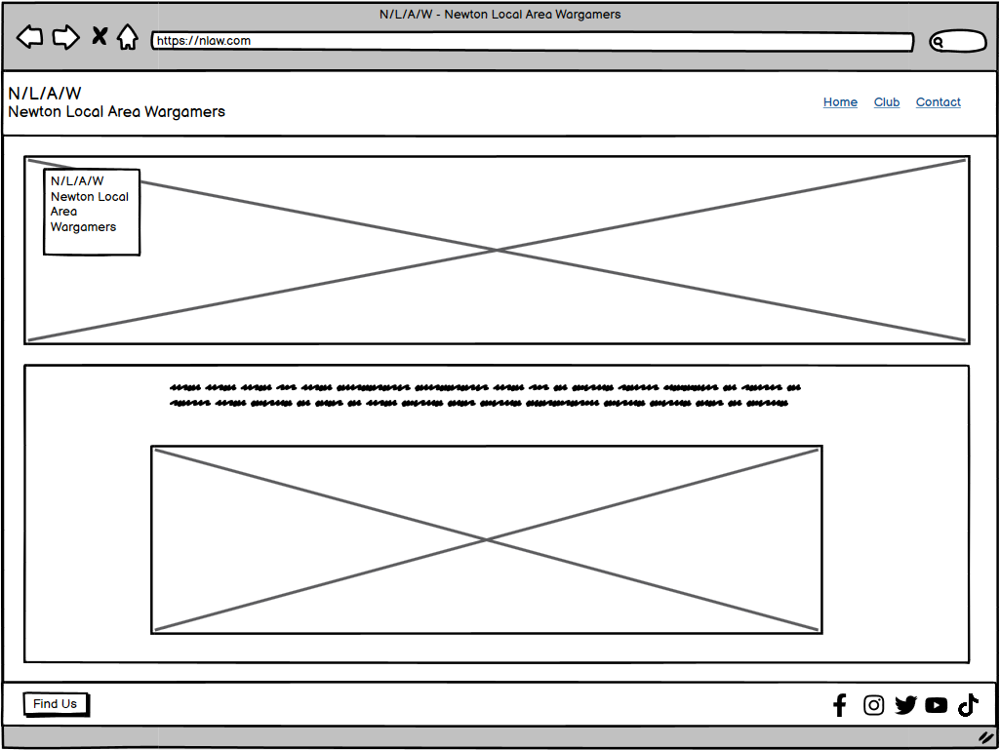
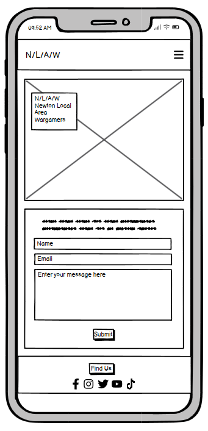
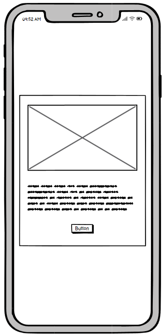
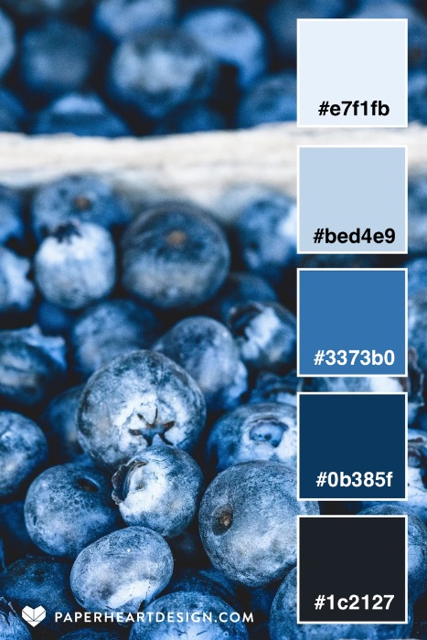
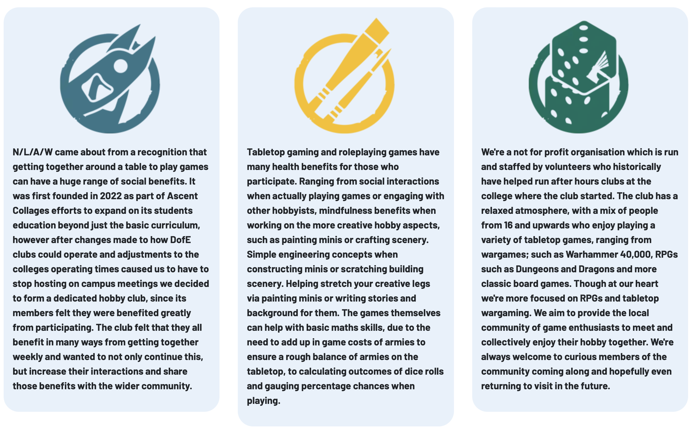

# **N/L/A/W - Newton Local Area Wargamers**

A website created for the first milestone project for Code Institutes full stack developer course.

[The deployed website can be found here.](https://monkphin.github.io/nlaw/)


# Contents

- [User Experience](#user-experience)

  - [The Clubs Goals](#hobby-club-goals)
  - [A Visitors Goals](#visitor-goals)

- [User Stories](#user-stories)
  - [Club Visitor](club-visitor)
  - [Mobile User](mobile-user)
  - [Club Owner](club-owner)


- [Design](#design)

  - [Wireframes](#wireframes)
  - [Colour Palette](#colour-palette)
  - [Typography](#typography)
  - [Images](#images)
  - [Icons](#icons)

- [Features](#features)

  - [Header](#header)
  - [Footer](#footer)
  - [Modal](#modal)
  - [Home Page](#home-page)
  - [Club Page](#club-page)
  - [Contact Page](#contact-page)
  - [Response Page](#response-page)
  - [404 Page](#404-page)
  - [Sticky Nav](#sticky-nav)
  - [Carousel](#carousel)
  - [Future Features](#future-features)

- [Bugs and Issues](#bugs-and-issues)

  - [Index Page](#index-page)

- [Technology](#technology)

  - [Languages](#languages)
  - [Frameworks and Programs](#frameworks-and-programs)

- [Testing](#testing-and-validation)

  - [HTML Validation](#html-validation)
  - [CSS Validation](#css-validation)
  - [Accessibility](#accessibility)
  - [User Testing](#user-testing)
  - [Performance](#performance)

- [Deployment](#deployment)

- [Credits](#credits)

# User Experience

N/L/A/W is a local tabletop wargames group that started life as a small afterschool club in a local autism college.

The club would like to have a presence online outside of standard social media to allow other hobbyists and wargame enthusiasts to find out more about the club and what they do, as such they opted to commission someone to develop a website to allow them to do this.

## Hobby Club Goals:

- To inform other hobbyists in the Newton-le-Willows area that there is a club space available for like-minded hobbyists so that we grow our membership.
- Provide essential information on the club such as meeting times and location.
- To show images of the club to potential guests and members.
- Ideally, signpost some of the games that we commonly play.
- The website should have a simple and easy-to-navigate structure that reacts to the type of device it's being viewed.
- Visitors should be able to contact the club to be able to enquire about joining us, as well as ask any questions they may have before first visiting.
- For the club's social channels to be signposted.
- To be designed in a way that's sympathetic to our user base's accessibility requirements.

## Visitor Goals:

- To find some information about the club such as what games are commonly played.
- To know when and where the club meet.
- To be able to see pictures of the club so that I know what to expect when I visit.
- To know what the club offers, such as available gaming tables, spaces for 'hobbying' and to be informed about what facilities are onsite, as well as any rules the club may have. 
- To be able to contact the club to ask any questions I may have before visiting
- To be able to easily navigate the site irrespective of device

# User Stories

## Club Visitor
1.As a user, I want to know more about the club, so that I can decide if it's the kind of place I might want to visit. 
2. As a user, I want to know more about what the club is about, so that I can decide if it's something I’m interested in. 
3. As a user, I want to know the location of the club, so I can visit the club if I want to.
4. As a user, I want to know the games the club mostly plays, so that I can know if this matches my own interests.
5. As a user, I want to see images of the club and their minis, so that I can get a feel for what the club is like.
6. As a user, I want to know the clubs opening hours, so that I know if I can fit visiting into my schedule. 
7. As a user, I want to know if there are any costs, so that I know what, if anything I need to pay. 
8. As a user, I want to be able to contact the club, so that I can ask any further questions I may have. 
9 . As a user, I want to know if food and drink are available and if I can take my own, so that I know if I should eat/drink before visiting or take my own if it's allowed. . 

## Mobile User
10. As a mobile user, I want the site to accommodate the device I am on, so that the site is readable and can be browsed with minimal effort. 
11. As a mobile user, I want the site to render correctly on my device, so that I have a good user experience.
12. As a mobile user, I want a navigation menu that is appropriate to my device, so that I don't need to try to zoom and move around on the screen to tap links that may be otherwise too small. 

## Club Owner
13. As a Club Owner, I want to provide basic information, such as location, opening hours, cost to attend, so that I can cut down on the need for visitors to contact us to find this out. 
14. As a Club Owner, I want visitors to know about the club's rules, so that visitors will know what standard of behaviour is expected while visiting us. 
15. As a Club Owner, I want the users to be able to contact us, so that they may ask any questions or seek clarification. 
16. As a Club Owner, I want visitors to know how to find us and what transport options there are, so that visitors can visit our club with minimal effort. 
17. As a Club Owner, I want visitors to know the benefits of the tabletop gaming hobby and community, so that they know that there's more to the club than just playing games and how the hobby can help benefit them personally too. 
18. As a Club Owner, I want visitors to know the club's history, so that they’re aware we are welcoming to folk who have ASD diagnosis and can help cater to their needs and requirements. 

# Design

The design process needed to factor in the club's history, since many of its members are autistic, thanks to its roots in a local autism college.

The following sites were used to help research requirements for autism-friendly design elements:

- [Horlix - Making your autism friendly website](https://www.horlix.com/making-your-autism-friendly-website)
- [Overlay Facts - Digital Accessibility for Autism](https://overlayfacts.org/blog/digital-accessibility-web-design-for-autism)
- [UX Design - Designing for Autistic People](https://uxdesign.cc/designing-for-autistic-people-overview-of-existing-research-d6f6dc20710e)

Due to this, several iterations of the site were wireframed before a look was settled on with attempts to work to the UK Department of Health guidelines for ASD-friendly design as outlined [here](https://file.scirp.org/pdf/JSEA_2014022510055814.pdf)

While the final design breaks some of the Department of Health recommendations, steps have been taken to assist where potential for confusion may occur such as the inclusion of bounding boxes. Examples of this method were observed from several other websites that have been lauded for ASD-focused design.

- [Autism Advocacy](https://autisticadvocacy.org)
- [Sesame Street](https://sesameworkshop.org/topics/autism)

Overall I feel this finds a balance between a clean design and an autism friendly one.

## Wireframes:

Wireframes were created with Balsamiq software to provide rough mockups for layout.

<details>
<summary>Desktop</summary>

<details>
<summary>Homepage Desktop</summary>

</details>

<details>
<summary>Club Desktop</summary>

</details>

<details>
<summary>Contact Desktop</summary>

</details>

<details>
<summary>Response Desktop</summary>

</details>

<details>
<summary>404 Desktop</summary>

</details>
</details>

<details>
<summary>Mobile</summary>

<details>
<summary>Homepage Mobile</summary>

</details>

<details>
<summary>Club Mobile</summary>

</details>

<details>
<summary>Contact Mobile</summary>

</details>

<details>
<summary>Response Mobile</summary>

</details>

<details>
<summary>404 Mobile</summary>

</details>

</details>


## Colour Palette.

The colours were selected to be sympathetic to the user base, using [Paper Heart Design's peaceful pallettes](https://paperheartdesign.com/blog/color-palette-peaceful-palettes) to help pick out soothing and low-contrast colour palettes that could work for some of the user base. Of those presented, I feel the 'Blueberry Bliss' selection gives a reasonable range of tones and colour options.



## Typography.

As with the other design elements, some care was needed around font usage, specifically using sans-serif fonts.
To this end, after browsing Fontpair and Google fonts I finally settled on Inter and Barlow, both of which fit the guidelines of being clear and sans-serif while looking good. Inter is used for the header and footer, with Barlow being used for the main content.


Future features that would allow for better levels of support include the ability to pick and choose fonts, font background and colour options, font size and other similar customisation options.

## Images

Images were sourced primarily from Games Workshop's website, as well as other hobby club pages, credits for these will be provided at the end of the readme.

## Icons

Icons were provided by [FontAwesome](https://fontawsome.com)

# Features

The website consists of 4 pages: 
 - home page
 - club page
 - contact page
 - response page 
 
The response page loads when the contact form is successfully submitted. The footer of each page also includes a modal, allowing information about the location of the club and its opening times to be available anywhere on the site. There is also a **custom 404** in case a visitor finds themselves trying to access a nonexistent part of the website, allowing them to head back to the main content.

## Header

The header allows for simple, responsive navigation so that visitors can utilise its function regardless of the device in use. On larger screens, it will expand to take the full space of the browser, while on mobile or narrow screens the menu will collapse down into a hamburger toggle and the additional subheading will vanish to ensure the menu remains uncluttered.

The menu items show an underline and change to #0b385f to show the current page. They and all other text-based links also change colour to #3373b0 on hover to provide feedback.


## Footer

The footer provides constant access to key information concerning the location and operating hours of the club. This modal responds to changes in screen size with both the opening hours and contact information shifting from horizontal to vertical layout as the amount of visible space decreases. The footer also contains links to various social media platforms where the club has some presence, allowing site visitors to interact with the club through other methods and see any other pictures of the venue and any hobby activities that may not be present on the website.


## Modal

The modal as previously mentioned provides a quick and easy way to find the club's address and opening hours. The base template for this was taken from an example provided by Bootstrap and features some amendments to styling and CSS of my own to make it fit the site more closely. There is also a clickable phone number, which will open your device's default phone system and auto-fill the number allowing a user to call the club with minimal effort.


## Sticky Nav

Since the site can get potentially quite long on smaller screen sizes the navbar is configured to remain in view at all times, allowing the user to easily move from page to page if they want to read information on a different page, or perhaps have a question they want to ask of the club while it's in mind.


## Carousel

Due to the index page becoming overly long when showing the list of games the group enjoys, the design was tweaked slightly to shift this list to the bottom of the main content and replace it with a carousel. The carousel was sourced from Bootstrap with some customisation being done to ensure it fit the site's designs, this meant using some fonts from FontAwesome to replace the left and right arrows since the default icons were proving difficult to format correctly. Grow from Hover.css is also used so that the images will zoom slightly on mouse over to show some interaction to the user when moving to tap/click on the image.


## Home Page

The site's homepage provides some of the club's history, as well as information about the wider tabletop gaming hobby and some of the possible benefits it can bring to those partaking in it. This page also features a list of game systems the club members enjoy the most to allow visitors to understand what games they may expect to be able to easily play if they visited in person. Early testing of the site showed some issues with how this was positioned when using mobiles and other smaller screened devices, where the main content was pushed quite far down the page. To resolve this Bootstrap ordering was used to move the games list to the bottom of the page on smaller screens. However, this also proved less than ideal since it just created an overly long vertical scroll. To mitigate this, the list is hidden on smaller screens and replaced by a carousel.

The page as a whole uses Bootstraps grid positioning to allow for positioning and responsive design, with stacked rows to allow for a column containing the list of games to be rendered on the left when on a desktop with the hero image to the right in another column directly above the three columns providing the club's background, information on tabletop gaming and some information about the club and its members. These will re-order depending on the size of the device, with the hero image showing the main room of the club always remaining at the top of the page.


Finally, much like on the carousel, the images will expand slightly thanks to Hover.css's grow function, to show the user that the image they're interacting with when mousing over it.


## Club page

This page provides more specific information on the club itself, concerning its gaming facilities and what food and drink options are available and some basic information regarding costs to access, again the hero image, showing the main room of the club is carried over. This page also features a list of club rules and also the address and phone number for the club, its opening hours and a Google map to aid people in visiting. Much like the home page this uses Bootstraps grid positioning system with various columns and rows and some nesting of these to help ensure a clean and responsive layout irrespective of the device that the site is accessed from. Much like with the modal, the opening times shift between horizontal and modal depending on the device screen size that the site is accessed from. Like in the modal, the phone number is clickable and will open the user's default calling application with the number pre-populated, or where none is configured, generate an OS-level dialogue box asking to select an application to use. 


## Contact Page

The contact page is a simple form asking for a name, email and a message. This has an action to call response.html, so it doesn't just error out and instead provides feedback to the user that an email has been sent. With further development, this would send an email to the club's email service on submission.

All fields borders highlight as they're clicked into to show the user which field they're working in and all fields require data to submit the form. The form is configured to be aware of if the email field has been filled in with normal text, rather than an email.


## Response Page

This page exists purely to provide feedback on submitting the form, rather than just erroring out. In a future iteration of the website, this page would still exist as a confirmation to provide feedback on a successful submission. But the form itself would submit the information provided. 


## 404 Page

A custom 404 error page was added, to keep the user on-site in the event of them somehow trying to load a non-existing page. This is built using the stock layout to allow users to easily navigate to any part of the site, rather than just leaving them with no route back or simply sending them back to the home page.


## Future features

As mentioned earlier in the document, it would be ideal to allow for a degree of personal customisation at the user level to allow for further improvements to accessibility. Adding a calendar that the club can update would also be a useful feature so they could show events that they may have coming up that may be of interest to visitors, this could potentially tie into a mailing list, which would require a database to store user details. Additionally, a gallery page could also be of use to show more pictures of the venue or projects the club are working on without visitors having to leave the site and visit the club's social pages.
<br><br>
Since I am using an older version of Bootstrap I have already created a development branch to migrate this over to Bootstrap 5, this will also give me a chance to refactor the HTML and CSS a little, since simply porting over to Bootstrap 5 presented a lot of rendering and layout issues which would need to be resolved.

# Bugs and issues.

## Bootstrap Cols

There is a minor issue with the height of the Bootstrap content boxes not properly adjusting and instead matching the height of their content on the home page.

<details>
<summary>Content Height Issue</summary>

</details>

This issue is also present on the club page, for the rules column. In both cases, I believe the issue to be caused by there being other tags wrapped inside the bootstrap tags. This makes some sense for the rules column since it denotes that the information contained within while related to the main content, is its own specific section. For the Homepage, this was to resolve an issue which I believe to be caused by how I'm nesting bootstrap containers, I believe this is also the root of the issue with the width of the content on the home page when on mobile. However, despite multiple attempts to resolve these issues, no fix has been found as yet.

I believe some of the issues mentioned above may be resolved when moving to Bootstrap 5 since this will also require some refactoring of the HTML and CSS.

# Technology.

## Languages

The site was built with HTML and CSS, any javascript in use is provided via Bootstrap, which was needed for the carousel and nav toggle.

## Frameworks and Programs.

- Bootstrap 4.2.1

  - Used for layout and positioning, and the navbar, modal and carousel.

- W3Schools

  - Used for help with CSS.

- HoverCSS

  - Used to provide 2D transitions on the games images.

- Git

  - Used for version control, storage and deployment.

- GoogleFonts

  - Used to import fonts to the stylesheet.

- VSCode

  - IDE of choice.

- Balsamiq

  - Wireframing program.

- WAVE

  - Used to assist with accessibility checks.

- Techsini

  - Mockup generator.

- Google Dev Tools

  - Used to help with troubleshooting.

- Pixelmator

  - Users for editing and resizing images.

- TinyPNG

  - used for image compression.

- Favicon.io

  - Used to generate a Favicon.

- Quicktime

  - Used to record footage of parts of the website for documentation

- Convertio

  - Used to convert .mov files to .gif files for the readme.md file.

- Prettier

  - Used to format files

# Testing and Validation

## HTML Validation

[W3Schools HTML Validator](https://validator.w3.org/)
All pages passed with 0 errors.

<details>
<summary>Homepage</summary>

</details>

<details>
<summary>Club Page</summary>

</details>

<details>
<summary>Contact Page</summary>

</details>

<details>
<summary>Response Page</summary>

</details>

<details>
<summary>404 Page</summary>

</details>

## CSS Validation

[W3Schools CSS Validator](https://jigsaw.w3.org/css-validator/)
Some errors were detected with the CSS when testing against the URL. These were all with external sheets provided by Hover.css or Bootstrap due to them using vendor-specific extensions. The raw CSS passed with 0 errors. However, a warning was presented due to the imported stylesheet for the fonts not being checked by the service.

<details>
<summary>Full site CSS</summary>

</details>

<details>
<summary>CSS File</summary>

</details>

<details>
<summary>CSS File Warning</summary>

</details>

## Accessibility

[WAVE](https://wave.webaim.org) was used to check to ensure the site conforms to accessibility standards. Several pages show redundant links - specifically contact.html, and response.html due to both the site logo and the home link in the nav bar both linking to the index page. Additionally, club.html shows two redundant links, one due to the aforementioned duplication on the navbar and also due to the telephone number link in the contact modal being a duplicate of the link on the contact section. Other than this, no issues are reported.

<details>
<summary>Homepage</summary>

</details>

<details>
<summary>Club Page</summary>


</details>

<details>
<summary>Contact Page</summary>

</details>

<details>
<summary>Response Page</summary>

</details>

<details>
<summary>404 Page</summary>

</details>

## User Testing.

Since the site is designed with ASD users in mind, I reached out to several friends who I know are diagnosed with ASD and provided feedback and suggestions. 
Comments included that the colour choice was calming and easy on the eye and that the site was easy to use, read and navigate with minimal issues.

## User Stories

  1.As a user, I want to know more about the club, so that I can decide if it's the kind of place I might want to visit. 
  
| Feature   | Action                                             | Expected Result                                                                           | Actual Result     |
| --------- | -------------------------------------------------- | ----------------------------------------------------------------------------------------- | ----------------- |
| Home Page | Visit the website and read basic about information | Provide the user information about the clubs history and the wider hobby and its benefits | Works as expected |

2. As a user, I want to know more about what the club is about, so that I can decide if it's something I’m interested in. 

| Feature    | Action                                                                                          | Expected Result                                                                                             | Actual Result      |
| ---------- | ----------------------------------------------------------------------------------------------- | ----------------------------------------------------------------------------------------------------------- | ------------------ |
| Home Page  | Visit the website and read information about the club in the second column                      | Provide the user information regarding the club itself, its members, and the overall atmosphere of the club | Works as expected  |
| Hero Image | Visit the website and see the Hero image, showing a picture of the club and some of its members | Provide the user with a visual representation of the club and its members on a busier session.              | Works as expected. |

3. As a user, I want to know the location of the club, so I can visit the club if I want to.

| Feature    | Action                                                                                                    | Expected Result                                                                                                          | Actual Result     |
| ---------- | --------------------------------------------------------------------------------------------------------- | ------------------------------------------------------------------------------------------------------------------------ | ----------------- |
| Address    | Navigate to the Club section of the website, scroll down and see the clubs address.                       | Find the address the club                                                                                                | Works as expected |
| Modal      | Click the 'Find Us' button on the bottom of the website to launch a modal, which shows the clubs address. | On any page except the 404 page, scroll to the bottom and click the button to display a modal showing the clubs address. | Works as expected |
| Google Map | Browse to the Club section, scroll down and see a google map, showing the location of the club.           | See a map showing the clubs location, clicking this to open the map in a new tab if desired.                             | Works as expected |

4. As a user, I want to know the games the club mostly plays, so that I can know if this matches my own interests.

| Feature   | Action                                                                  | Expected Result                                                                                                                                                                                                                                                      | Actual Result     |
| --------- | ----------------------------------------------------------------------- | -------------------------------------------------------------------------------------------------------------------------------------------------------------------------------------------------------------------------------------------------------------------- | ----------------- |
| Home Page | Browse to the website and view a list of games the club commonly plays. | On the clubs home page, a graphical list using logos for the clubs preferred games is present, these are also links which take the user to the relevant websites informing them of the games in more detail if they're new to the hobby and would like to know more. | Works as expected |

5. As a user, I want to see images of the club and their minis, so that I can get a feel for what the club is like.

| Feature                                                                          | Action                                                                                                                                                           | Expected Result                                                                                                                                                  | Actual Result      |
| -------------------------------------------------------------------------------- | ---------------------------------------------------------------------------------------------------------------------------------------------------------------- | ---------------------------------------------------------------------------------------------------------------------------------------------------------------- | ------------------ |
| Hero Image                                                                       | Visit the website and see the Hero image, showing a picture of the club and some of its members.                                                                 | Provide the user with a visual representation of the club and its members on a busier session.                                                                   | Works as expected. |
| Images elsewhere on the site                                                     | While browsing the site, be presented with some images of the clubs minis, games in play or the club itself.                                                     | Provide the user with some further visuals to show the club or its members collections.                                                                          | Works as expected. |
| Links to more visually based social networks like Instagram, TickTok and Youtube | While browsing the site, scroll to the bottom of any page except the 404 page and see working links to the club's social media presence, which open in new tabs. | Provide the user with methods to find the club's visual-based social platforms so they can see additional pictures or videos of the club, its members and minis. | Works as expected. |


6. As a user, I want to know the clubs opening hours, so that I know if I can fit visiting into my schedule. 

| Feature                    | Action                                                                                                          | Expected Result                                                                                                               | Actual Result     |
| -------------------------- | --------------------------------------------------------------------------------------------------------------- | ----------------------------------------------------------------------------------------------------------------------------- | ----------------- |
| Modal                      | Click the 'Find Us' button on the bottom of the website to launch a modal, which shows the clubs opening times. | On any page except the 404 page, scroll to the bottom and click the button to display a modal showing the clubs opening times. | Works as expected |
| Opening Times on Club Page | Navigate to the Club Page of the website, scroll down and see the clubs opening times below the map.            | See a list of opening times for the club to allow visitors to know when they're open.                                         | Works as expected |


7. As a user, I want to know if there are any costs, so that I know what, if anything I need to pay. 

| Feature                       | Action                                                                                 | Expected Result                                      | Actual Result                          |
| ----------------------------- | -------------------------------------------------------------------------------------- | ---------------------------------------------------- | -------------------------------------- |
| Club pricing on the Club page | Navigate to the Club Page of the website and read the information in the second column | See any pricing that is applicable to using the club | Works as expected but could be clearer |


8. As a user, I want to be able to contact the club, so that I can ask any further questions I may have. 

| Feature                         | Action                                                                                                                                                                         | Expected Result                                                                                                                                                                                                                                                                                                      | Actual Result     |
| ------------------------------- | ------------------------------------------------------------------------------------------------------------------------------------------------------------------------------ | -------------------------------------------------------------------------------------------------------------------------------------------------------------------------------------------------------------------------------------------------------------------------------------------------------------------- | ----------------- |
| Modal                           | Click the 'Find Us' button on the bottom of the website to launch a modal, which shows the clubs phone number.                                                                 | On any page except the 404 page, scroll to the bottom and click the button to display a modal showing the clubs contact number and opens in the default phone system when clicked.                                                                                                                                   | Works as expected |
| Contact number on the Club page | Navigate to the Club Page of the website, scroll down and see the clubs contact number.                                                                                        | Find the clubs phone number and have it open and populate the devices phone system to allow the user to call the club                                                                                                                                                                                                | Works as expected |
| Contact Form                    | Navigate to the Contact Page of the website, and be presented with a contact form which can be filled in and then be presented with feedback advising the email has been sent. | On the contact page their is a form which has all fields required, including rejecting anything but an email address when entering it in the email field. This then opens the response page when the submit button is clicked, assuring the user that their message has been sent and someone will be in touch soon. | Works as expected |


9. As a user, I want to know if food and drink are available and if I can take my own, so that I know if I should eat/drink before visiting or take my own if it's allowed.

| Feature                      | Action                                                                                                                                                                  | Expected Result                                             | Actual Result     |
| ---------------------------- | ----------------------------------------------------------------------------------------------------------------------------------------------------------------------- | ----------------------------------------------------------- | ----------------- |
| Information on the Club Page | Click the club page and read the second text box outlining if the club offer food and drink as well as policies around consuming them or bringing your own to the club. | Find information about the clubs policies on food and drink | Works as expected |


10. As a user, I want to be able to browse to any social networks the site is on to allow me to communicate and interact with them in different ways.  

| Feature                                         | Action                                                                                                                                                                          | Expected Result                                                                                                                             | Actual Result     |
| ----------------------------------------------- | ------------------------------------------------------------------------------------------------------------------------------------------------------------------------------- | ------------------------------------------------------------------------------------------------------------------------------------------- | ----------------- |
| Social Media links in the footer of the website | On any page of the website, scroll to the bottom of the page to see the footer. In the footer find the relevant social platform and click it to take you to the social platform. | All pages except the 404 page contain links to the club's social media platforms, which when clicked open the relevant website in a new tab. | Works as expected |


11. As a mobile user, I want the site to accommodate the device I am on, so that the site is readable and can be browsed with minimal effort. 
12. As a mobile user, I want the site to render correctly on my device, so that I have a good user experience.
13. As a mobile user, I want a navigation menu that is appropriate to my device, so that I don't need to try to zoom and move around on the screen to tap links that may be otherwise too small. 

| Feature            | Action                                                                                                                                                                                                                                                                                                                                                          | Expected Result                                                                                                                                                                                                                                                                                                                                                                                                                                                                                                                                                                                                                                                                                                                                                                                                                                                                                                                  | Actual Result      |
| ------------------ | --------------------------------------------------------------------------------------------------------------------------------------------------------------------------------------------------------------------------------------------------------------------------------------------------------------------------------------------------------------- | -------------------------------------------------------------------------------------------------------------------------------------------------------------------------------------------------------------------------------------------------------------------------------------------------------------------------------------------------------------------------------------------------------------------------------------------------------------------------------------------------------------------------------------------------------------------------------------------------------------------------------------------------------------------------------------------------------------------------------------------------------------------------------------------------------------------------------------------------------------------------------------------------------------------------------- | ------------------ |
| Responsive content | Fonts on the website should remain legible and be sympathetic to the device the user is browsing on. Images should factor in device sizing so as not to force horizontal scrolling.                                                                                                                                                                             | The website utilises relative sizing for fonts, allowing them to adapt to the users device. Image sizes are similarly set up to be based around percentiles to allow them to adapt to the available space.                                                                                                                                                                                                                                                                                                                                                                                                                                                                                                                                                                                                                                                                                                                       | Works as expected  |
| Responsive design  | The website should be able to cater to any device it is accessed from, shifting how content is layed out so that devices with limited horizontal space do not end up trying to cram lots of information into them. Similarly it also needs to avoid being overly long where it can be helped, particuarly when the information is potentially of lesser import. | The website utilises Bootstraps positioning system to help dynamically adjust where content is positioned depending on device sizing. Certain elements will be hidden, again using bootrap, allowing new elements to be shown, for exampl the list of games is removed from the side of the site and its ordering is changed to the bottom of the site with the content replaced by a carousel, which allows a user to still access this information, but to do so in a less obtrusive way. The Sites subheading below the site name is hidden on smaller devices and any horizontal tables are built using Bootstrap to allow them to adapt to screen sizes, again with the table being hidden and replaced where it makes sense to do so. In addition media queries are used, targeting min-size so that the initial design focus is more on smaller mobile devices, which allow the site to adapt to different screen widths. | Works as expected. |
| Responsive Navbar  | When on a mobile device, browse to the website and be presented by a nav bar which is sympathetic to smaller screen sizes, utilising hamburger menus, removing uneeded text and being stuck to the top of the screen so its always visible when scolling long content.                                                                                          | Navbar utilises Bootstrap to present mobile users with a hamburger menu, remove any text beyond the site logo and is sticky to the top of the browser window, with the website content flowing behind it when the user scrolls.                                                                                                                                                                                                                                                                                                                                                                                                                                                                                                                                                                                                                                                                                                  | Works as expected. |


14. As a Club Owner, I want to provide basic information, such as location, opening hours, cost to attend and transport options, so that I can cut down on the need for visitors to contact us to find this out. 
15. As a Club Owner, I want visitors to know about the club's rules, so that visitors will know what standard of behaviour is expected while visiting us. 

| Feature   | Action                                                                                                                                                                                                                                    | Expected Result                                                                                                                                                                                                                                             | Actual Result      |
| --------- | ----------------------------------------------------------------------------------------------------------------------------------------------------------------------------------------------------------------------------------------- | ----------------------------------------------------------------------------------------------------------------------------------------------------------------------------------------------------------------------------------------------------------- | ------------------ |
| Club Page | Navigate to the club page, where the visitor will be presented with information regarding the clubs rules, pricing, location, contact number, a map to help with navigating to the club, and information on parking and public transport. | The visitor is presented with information answering some fairly standard questions without the need to contact the club, providing information on where the club is, how to call the club, how to get to the club and any rules or costs that are in place. | Works as expected. |


16. As a Club Owner, I want the users to be able to contact us, so that they may ask any questions or seek clarification. 
| Feature      | Action                                                                                                                                                                         | Expected Result                                                                                                                                                                                                                                                                                                      | Actual Result     |
| ------------ | ------------------------------------------------------------------------------------------------------------------------------------------------------------------------------ | -------------------------------------------------------------------------------------------------------------------------------------------------------------------------------------------------------------------------------------------------------------------------------------------------------------------- | ----------------- |
| Contact Form | Navigate to the Contact Page of the website, and be presented with a contact form which can be filled in and then be presented with feedback advising the email has been sent. | On the contact page their is a form which has all fields required, including rejecting anything but an email address when entering it in the email field. This then opens the response page when the submit button is clicked, assuring the user that their message has been sent and someone will be in touch soon. | Works as expected |


17. As a Club Owner, I want visitors to know the benefits of the tabletop gaming hobby and community, so that they know that there's more to the club than just playing games and how the hobby can help benefit them personally too. 
18. As a Club Owner, I want visitors to know the club's history, so that they’re aware we are welcoming to folk who have ASD diagnosis and can help cater to their needs and requirements. 

| Feature                 | Action                                                                                                         | Expected Result                                                                                                                                   | Actual Result     |
| ----------------------- | -------------------------------------------------------------------------------------------------------------- | ------------------------------------------------------------------------------------------------------------------------------------------------- | ----------------- |
| Home Page First Column  | Visit the website and read information about the clubs history contained in the first column.                  | Provide the user information about the clubs history and the wider hobby and its benefits.                                                        | Works as expected |
| Home Page Second Column | Visit the website and read information about the club in the second column.                                    | Provide the user information regarding the club itself, its members, and the overall atmosphere of the club.                                      | Works as expected |
| Home Page Third Column  | Visit the website and read information about the hobby and some of the benefits participation in it can bring. | Provide the visitor information regarding possible benefits of being a member of the tabletop hobby community and, by proxy, a member of the club | Works as expected |


19. As a Club Owner, I want to signpost the location of any social channels we may have, so that visitors are aware of where else we can be interacted with online. 

| Feature                                         | Action                                                                                                                                                                          | Expected Result                                                                                                                             | Actual Result     |
| ----------------------------------------------- | ------------------------------------------------------------------------------------------------------------------------------------------------------------------------------- | ------------------------------------------------------------------------------------------------------------------------------------------- | ----------------- |
| Social Media links in the footer of the website | On any page of the website, scroll to the bottom of the page to see the footer. In the footer find the relvant social plaftorm and click it to take you to the social platform. | All pages except the 404 page contain links to the club's social media platforms, which when clicked open the relvant website in a new tab. | Works as expected |

## Performance

Overall loading times and performance were tested using Google’s lighthouse tool within Chrome's Developer Tools.

Several optimisations were put in place based on early test outputs and lighthouse recommendations. These include preloading the Hero image, since this is called from the CSS file which can add some delay to rendering. Pre-connecting for third-party hosted resources, such as Bootstraps javascript and CSS. Performing optimisations on images by running them through compression tools and reformatting as Webp files.

It's worth noting that in spite of these optimisations improving scores, they're still not entirely perfect and different results have been seen when testing on different devices. For example, testing the club.html page when on an M1-based Mac showed no issues with Best Practices. But carrying out the same tests on a Desktop PC running Windows 11 showed a lower score here, due to how Google Maps is being called. Similarly, some performance outcomes varied from device to device. Essentially suggesting that device-level factors can impact the outcome of Lighthouse testing.

There are also other factors to consider that are beyond my control currently. Such as the fact the live version of the site is hosted on GitHub, and that there are reliances on third-party frameworks, such as Bootstrap or Hover.css. Meaning I cannot optimise the hosting that these are provided from and cannot account for possible load or other issues they're having when testing is carried out.  

Finally, theirs a lot of information to support Lighthouse testing against absolute worse case scenarios such as [using 3G when testing for mobile for example](https://stackoverflow.com/questions/58394704/google-page-speed-insights-lighthouse-measurement-origin#:~:text=All%20tests%20are%20run%20using,3G%20network%20%26%204x%20CPU%20slowdown.&text=Concluding%20I%20would%20say%20that,not%20very%20clear%20about%20this.)

All of the above will be factors when performing lighthouse testing, which could contribute to lower scores being seen and some variance from test to test and device to device.

<details>
<summary>Home Page</summary>

<br>The hero image is presenting the mainstay of issues here despite steps taken to try to mitigate this. With the LCP showing a time of 6s
<br>
The Best Practices score was dropped due the column images being seen as low resolution, specifically the 'build.webp' image, interestingly the other two images were not called out, despite them all being the same size and DPI.
</details>

<details>
<summary>Club Page</summary>

<br>
Like with the home page performance issues were suggested to be relating to the hero image. With the main issue being load time, which recorded 4,000 ms.
</details>

<details>
<summary>Contact Page</summary>

<br>
On this page we saw LCP being the main culprit, with render delay hitting 1,440 ms.  
</details>

<details>
<summary>Response Page</summary>

<br>
Again, we see the hero image showing issues with render delay of around 2,750ms.
</details>

<details>
<summary>404 Page</summary>

<br>
This was, unsurprisingly, the most performant of pages due to having significantly less content and any links to unused frameworks removed.
<br>
The Best Practice call out was due to a low image resolution on the lost.webp file.
</details>

# Deployment

## Device and Browser Testing
The site has been tested on several physical devices specifically: 
- WIndows Desktop PC
- Apple M1 MacBook Pro
- iPhone 14 Pro Max 
- Samsung Galaxy S24

In Addition the following browsers have all been used in testing: 
 - Chrome
 - Safari 
 - Firefox

## Responsiveness
Responsiveness testing was carried out using Chromes Developer Tools.

<details>
<summary>Galaxy Pixel Fold</summary>

| Device and Resolution | Page          | Result               |
| --------------------- | ------------- | -------------------- |
| Galaxy Pixel Fold     | Home Page     | Displays as Expected |
| 280 x 653             | Club Page     | Displays as Expected |
|                       | Contact Page  | Displays as Expected |
|                       | Response Page | Displays as Expected |
|                       | 404 Page      | Displays as Expected |
|                       | Nav Bar       | Displays as Expected |
|                       | Carousel      | Displays as Expected |
|                       | Modal         | Displays as Expected |
</details>

<details>
<summary>iPhone SE</summary>

| Device and Resolution | Page          | Result               |
| --------------------- | ------------- | -------------------- |
| iPhone SE             | Home Page     | Displays as Expected |
| 375 x 667             | Club Page     | Displays as Expected |
|                       | Contact Page  | Displays as Expected |
|                       | Response Page | Displays as Expected |
|                       | 404 Page      | Displays as Expected |
|                       | Nav Bar       | Displays as Expected |
|                       | Carousel      | Displays as Expected |
|                       | Modal         | Displays as Expected |
</details>

<details>
<summary>iPhone 12 Pro</summary>

| Device and Resolution | Page          | Result               |
| --------------------- | ------------- | -------------------- |
| iPhone 12 Pro         | Home Page     | Displays as Expected |
| 390 x 844             | Club Page     | Displays as Expected |
|                       | Contact Page  | Displays as Expected |
|                       | Response Page | Displays as Expected |
|                       | 404 Page      | Displays as Expected |
|                       | Nav Bar       | Displays as Expected |
|                       | Carousel      | Displays as Expected |
|                       | Modal         | Displays as Expected |
</details>

<details>
<summary>Samsung Galaxy A51/71</summary>

| Device and Resolution | Page          | Result               |
| --------------------- | ------------- | -------------------- |
| Samsung Galaxy A51/71 | Home Page     | Displays as Expected |
| 412 x 914             | Club Page     | Displays as Expected |
|                       | Contact Page  | Displays as Expected |
|                       | Response Page | Displays as Expected |
|                       | 404 Page      | Displays as Expected |
|                       | Nav Bar       | Displays as Expected |
|                       | Carousel      | Displays as Expected |
|                       | Modal         | Displays as Expected |
</details>

<details>
<summary>iPhone 14 Pro Max</summary>

| Device and Resolution | Page          | Result               |
| --------------------- | ------------- | -------------------- |
| iPhone 14 Pro Max     | Home Page     | Displays as Expected |
| 430 x 932             | Club Page     | Displays as Expected |
|                       | Contact Page  | Displays as Expected |
|                       | Response Page | Displays as Expected |
|                       | 404 Page      | Displays as Expected |
|                       | Nav Bar       | Displays as Expected |
|                       | Carousel      | Displays as Expected |
|                       | Modal         | Displays as Expected |
</details>

<details>
<summary>Surface Pro Duo</summary>

| Device and Resolution | Page          | Result               |
| --------------------- | ------------- | -------------------- |
| Surface Pro Duo       | Home Page     | Displays as Expected |
| 540 x 720             | Club Page     | Displays as Expected |
|                       | Contact Page  | Displays as Expected |
|                       | Response Page | Displays as Expected |
|                       | 404 Page      | Displays as Expected |
|                       | Nav Bar       | Displays as Expected |
|                       | Carousel      | Displays as Expected |
|                       | Modal         | Displays as Expected |
</details>

<details>
<summary>iPad Mini</summary>

| Device and Resolution | Page          | Result               |
| --------------------- | ------------- | -------------------- |
| iPad Mini             | Home Page     | Displays as Expected |
| 768 x 1024            | Club Page     | Displays as Expected |
|                       | Contact Page  | Displays as Expected |
|                       | Response Page | Displays as Expected |
|                       | 404 Page      | Displays as Expected |
|                       | Nav Bar       | Displays as Expected |
|                       | Carousel      | Displays as Expected |
|                       | Modal         | Displays as Expected |
</details>

<details>
<summary>ASUS ZenBook Fold</summary>

| Device and Resolution | Page          | Result               |
| --------------------- | ------------- | -------------------- |
| ASUS ZenBook Fold     | Home Page     | Displays as Expected |
| 853 x 1280            | Club Page     | Displays as Expected |
|                       | Contact Page  | Displays as Expected |
|                       | Response Page | Displays as Expected |
|                       | 404 Page      | Displays as Expected |
|                       | Nav Bar       | Displays as Expected |
|                       | Carousel      | Displays as Expected |
|                       | Modal         | Displays as Expected |
</details>

<details>
<summary>Surface Pro 7</summary>

| Device and Resolution | Page          | Result               |
| --------------------- | ------------- | -------------------- |
| Surface Pro 7         | Home Page     | Displays as Expected |
| 912 x 1368            | Club Page     | Displays as Expected |
|                       | Contact Page  | Displays as Expected |
|                       | Response Page | Displays as Expected |
|                       | 404 Page      | Displays as Expected |
|                       | Nav Bar       | Displays as Expected |
|                       | Carousel      | Displays as Expected |
|                       | Modal         | Displays as Expected |
</details>

<details>
<summary>iPad Pro</summary>

| Device and Resolution | Page          | Result               |
| --------------------- | ------------- | -------------------- |
| iPad Pro              | Home Page     | Displays as Expected |
| 1024 x 1366           | Club Page     | Displays as Expected |
|                       | Contact Page  | Displays as Expected |
|                       | Response Page | Displays as Expected |
|                       | 404 Page      | Displays as Expected |
|                       | Nav Bar       | Displays as Expected |
|                       | Carousel      | Displays as Expected |
|                       | Modal         | Displays as Expected |
</details>

<details>
<summary>Nest Hub Max</summary>

| Device and Resolution | Page          | Result               |
| --------------------- | ------------- | -------------------- |
| Nest Hub Max          | Home Page     | Displays as Expected |
| 1280 x 800            | Club Page     | Displays as Expected |
|                       | Contact Page  | Displays as Expected |
|                       | Response Page | Displays as Expected |
|                       | 404 Page      | Displays as Expected |
|                       | Nav Bar       | Displays as Expected |
|                       | Carousel      | Displays as Expected |
|                       | Modal         | Displays as Expected |
</details>

## User Story Testing
Features: 1, 2 and 4
As a user, I want to know more about the club, so that I can decide if it's the kind of place I might want to visit. 
As a user, I want to know more about what the club is about, so that I can decide if it's something I’m interested in. 
As a user, I want to know the games the club mostly plays, so that I can know if this matches my own interests.


# Deployment

This project is currently hosted on Github Pages which was deployed from the main branch.

## Cloning Locally

To work on the site on your local machine a local clone will be needed.
Please follow the below steps to clone this repo.
_ Log into github and browse to this repo.
_ Click the green button labeled 'Code' and ensure the 'Local' tab is selected.
_ Click on https and copy the provided link
_ Open your local CLI with Git support or IDE that supports Git CLI
_ Change your directory to the one where you wish to clone the directory to.
_ type 'git clone' and paste the previously copied URL and press enter.
`  $ git clone https://github.com/monkphin/nlaw.git
 `
This will generate the below output. > Cloning into `CI-Clone`... > remote: Counting objects: 10, done. > remote: Compressing objects: 100% (8/8), done. > remove: Total 10 (delta 1), reused 10 (delta 1) > Unpacking objects: 100% (10/10), done.


## Branching

If you need to develop new features that may impact the currently running hosted site on Github Pages, the repo will need a branch creating.
To do this, the following steps can be followed

Web:
_ Click on the button marked 'main' and click 'view all branches'
_ Click the green 'New Branch' button
_ In the spawned modal, enter a name for the branch and select which source you are branching from if more than one branch exists.
_ Click the green 'Create Branch' button.

CLI:
Assuming you are currently working on the 'main' branch
In your CLI type the following git checkout -b <branch name>

    ```
    darren@local MINGW64 ~/Code/nlaw (main)
    $ git checkout -b new-feature
    ```
    This will generate the below output
    ```
    Switched to a new branch 'new-feature'
    darren@local MINGW64 ~/Code/nlaw (new-feature)
    ```
    Any changes you make to the code from this point on will be in the newly created branch.

Adjustments can be made to the underlying code of the site without impacting the deployed build by creating a branch.

# Credits

Images were sourced from a few locations, the details of which are below. No creator credits were able to be located when checking these websites.

- Hero Image - [Wargames Reading](https://wargamesreading.co.uk/)

- Main body section images on index.html - [Warhammer](http://warhammer.com)

- Games logos on index.html -

  - Warhammer 40,000 [Warhammer](http://warhammer.com)
  - Age of Sigmar [Warhammer](http://warhammer.com)
  - Necromunda [Warhammer](http://warhammer.com)
  - Warcry [Warhammer](http://warhammer.com)
  - Kill Team [Warhammer](http://warhammer.com)
  - Horus Heresy [Warhammer](http://warhammer.com)
  - The Walking Dead [Mantic Games](https://www.manticgames.com/)
  
  - Dungeons & Dragons [Wizards of the Coast](https://dnd.wizards.com/)

- Main body images on club.html - [Warhammer](http://warhammer.com)

- 404.html image [Warhammer](http://warhammer.com)

- Main body image on response.html - [Goonhammer](https://www.goonhammer.com/the-belated-vadinax-week-9-update/)

- The text was adapted from copy found on [Exploding Dice](https://www.explodingdicetabletop.com/)
