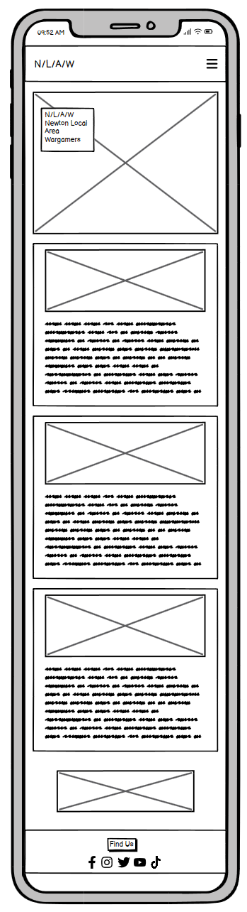
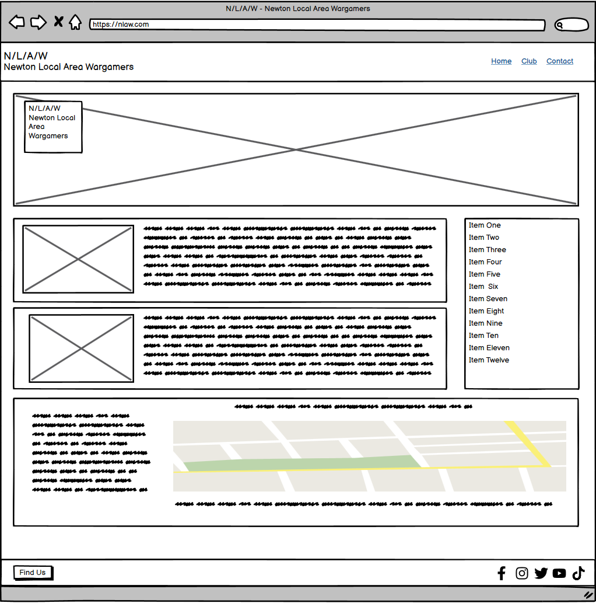
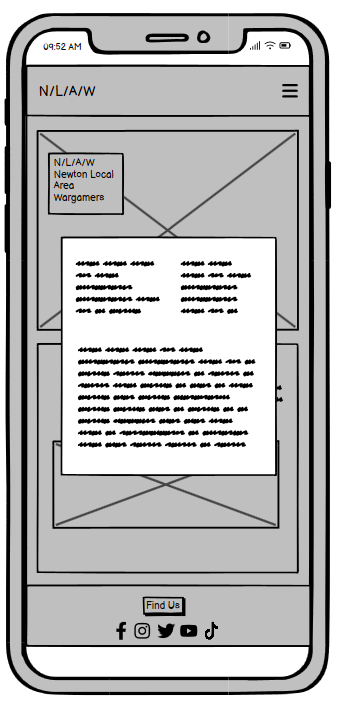
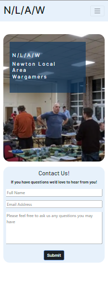
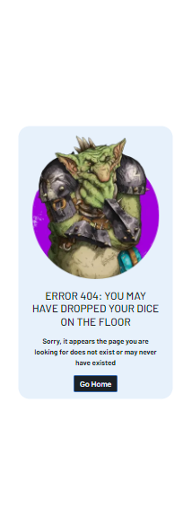
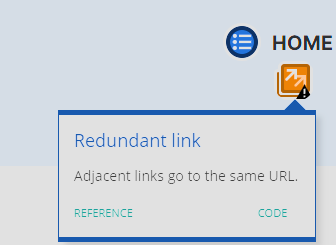
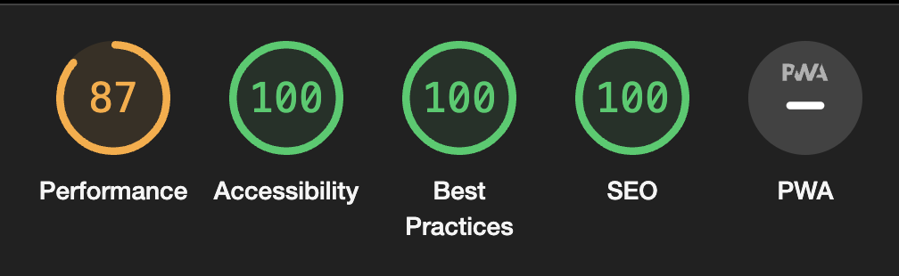
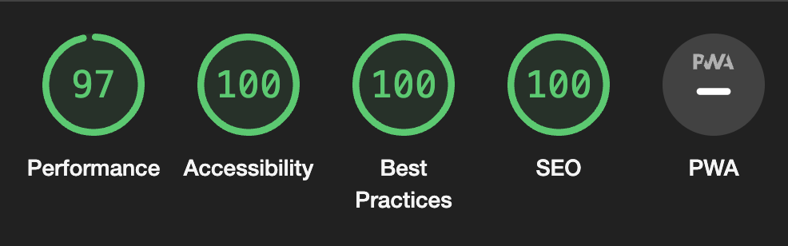

# **N/L/A/W - Newton Local Area Wargamers**

A website created for the first milestone project for Code Institutes full stack developer course.

[The deployed website can be found here.](https://monkphin.github.io/nlaw/)


# Contents

- [User Experience](#user-experience)

  - [The Clubs Goals](#hobby-club-goals)
  - [A Visitors Goals](#visitor-goals)

- [User Stories](#user-stories)

  - [Club Visitor](#club-visitor)
  - [Mobile User](#mobile-user)
  - [Club Owner](#club-owner)

- [Design](#design)

  - [Wireframes](#wireframes)
  - [Colour Palette](#colour-palette)
  - [Typography](#typography)
  - [Images](#images)
  - [Icons](#icons)

- [Features](#features)

  - [Header](#header)
  - [Footer](#footer)
  - [Modal](#modal)
  - [Home Page](#home-page)
  - [Club Page](#club-page)
  - [Contact Page](#contact-page)
  - [Response Page](#response-page)
  - [404 Page](#404-page)
  - [Sticky Nav](#sticky-nav)
  - [Carousel](#carousel)
  - [Future Features](#future-features)

- [Bugs and Issues](#bugs-and-issues)

  - [Index Page](#index-page)

- [Technology](#technology)

  - [Languages](#languages)
  - [Frameworks and Programs](#frameworks-and-programs)

- [Testing](#testing-and-validation)

  - [HTML Validation](#html-validation)
  - [CSS Validation](#css-validation)
  - [Accessibility](#accessibility)
  - [User Testing](#user-testing)
  - [User Stories](#user-story-testing)
  - [Performance](#performance)
  - [Device and Browser Testing](#device-and-browser-testing)
  - [Responsiveness](#responsiveness)


- [Version Control and Deployment](#version-control-and-deployment)
  - [Repository Creation](#repo-creation)
  - [Cloning Locally](#cloning-locally)
  - [Version Control](#version-control)
    - [CLI](#CLI)
    - [GitHub Website](#github-website)
  - [Branching](#branching)
  - [Deployment](#deployment)

- [Credits](#credits)


# User Experience

N/L/A/W is a local tabletop wargames group that started life as a small afterschool club in a local autism college.

The club would like to have a presence online outside of standard social media to allow other hobbyists and wargame enthusiasts to find out more about the club and what they do, as such they opted to commission someone to develop a website to allow them to do this.

## Hobby Club Goals:

- To inform other hobbyists in the Newton-le-Willows area that there is a club space available for like-minded hobbyists so that we can grow our membership.
- Provide essential information on the club such as meeting times and location.
- To show images of the club to potential guests and members.
- Ideally, signpost some of the games that we commonly play.
- The website should have a simple and easy-to-navigate structure that reacts to the type of device it's being viewed.
- Visitors should be able to contact the club to be able to enquire about joining us and ask any questions they may have before first visiting.
- For the club's social channels to be signposted.
- To be designed in a way that's sympathetic to our user base's accessibility requirements.

## Visitor Goals:

- To find some information about the club such as what games are commonly played.
- To know when and where the club meets.
- To be able to see pictures of the club so that I know what to expect when I visit.
- To know what the club offers, such as available gaming tables, and spaces for 'hobbying' and to be informed about what facilities are on site, and any rules the club may have.
- To be able to contact the club to ask any questions I may have before visiting
- To be able to easily navigate the site irrespective of device


# User Stories

## Club Visitor

1. As a user, I want to know more about the club, so that I can decide if it's the kind of place I might want to visit. <br>
2. As a user, I want to know more about what the club is about so that I can decide if it's something I’m interested in. <br>
3. As a user, I want to know the location of the club, so I can visit the club if I want to. <br>
4. As a user, I want to know the games the club mostly plays, so that I can know if this matches my interests. <br>
5. As a user, I want to see images of the club and their minis, so that I can get a feel for what the club is like. <br>
6. As a user, I want to know the club’s opening hours, so that I know if I can fit visiting into my schedule. <br>
7. As a user, I want to know if there are any costs so that I know what, if anything I need to pay. <br>
8. As a user, I want to be able to contact the club, so that I can ask any further questions I may have. <br>
9. As a user, I want to know if food and drink are available and if I can take my own so that I know if I should eat/drink before visiting or take my own if it's allowed. <br>

## Mobile User

10. As a mobile user, I want the site to accommodate the device I am on so that the site is readable and can be browsed with minimal effort. <br>
11. As a mobile user, I want the site to render correctly on my device so that I have a good user experience. <br>
12. As a mobile user, I want a navigation menu that is appropriate to my device, so that I don't need to try to zoom and move around on the screen to tap links that may be otherwise too small. <br>

## Club Owner

13. As a Club Owner, I want to provide basic information, such as location, opening hours, and cost to attend, so that I can cut down on the need for visitors to contact us to find this out. <br>
14. As a Club Owner, I want visitors to know about the club's rules, so that visitors will know what standard of behaviour is expected while visiting us. <br>
15. As a Club Owner, I want the users to be able to contact us, so that they may ask any questions or seek clarification. <br>
16. As a Club Owner, I want visitors to know how to find us and what transport options there are, so that visitors can visit our club with minimal effort. <br>
17. As a Club Owner, I want visitors to know the benefits of the tabletop gaming hobby and community, so that they know that there's more to the club than just playing games and how the hobby can help benefit them personally too. <br>
18. As a Club Owner, I want visitors to know the club's history, so that they’re aware we are welcoming to folk who have ASD diagnosis and can help cater to their needs and requirements. <br>
19. As a Club Owner, I want to signpost the location of any social channels we may have, so that visitors are aware of where else we can be interacted with online. <br>


# Design

The design process needed to factor in the club's history, since many of its members are autistic, thanks to its roots in a local autism college.

The following sites were used to help research requirements for autism-friendly design elements:

- [Horlix - Making your autism friendly website](https://www.horlix.com/making-your-autism-friendly-website)
- [Overlay Facts - Digital Accessibility for Autism](https://overlayfacts.org/blog/digital-accessibility-web-design-for-autism)
- [UX Design - Designing for Autistic People](https://uxdesign.cc/designing-for-autistic-people-overview-of-existing-research-d6f6dc20710e)

Due to this, several iterations of the site were wireframed before a look was settled on with attempts to work to the UK Department of Health guidelines for ASD-friendly design as outlined [here](https://file.scirp.org/pdf/JSEA_2014022510055814.pdf)

While the final design breaks some of the Department of Health recommendations, steps have been taken to assist where potential for confusion may occur such as the inclusion of bounding boxes. Examples of this method were observed from several other websites that have been lauded for ASD-focused design.

- [Autism Advocacy](https://autisticadvocacy.org)
- [Sesame Street](https://sesameworkshop.org/topics/autism)

Overall I feel this finds a balance between a clean design and an autism friendly one.

## Wireframes:

Wireframes were created with Balsamiq software to provide rough mockups for layout.

<details>
<summary>Homepage</summary>


</details>

<details>
<summary>Club</summary>


</details>

<details>
<summary>Contact</summary>


</details>

<details>
<summary>Response</summary>


</details>

<details>
<summary>404</summary>


</details>

<details>
<summary>Modal</summary>


</details>


## Colour Palette.

The colours were selected to be sympathetic to the user base, using [Paper Heart Designs peaceful palettes](https://paperheartdesign.com/blog/color-palette-peaceful-palettes) to help pick out soothing and low-contrast colour palettes that could work for some of the user base. Of those presented, I feel the 'Blueberry Bliss' selection gives a reasonable range of tones and colour options.


## Typography.

As with the other design elements, some care was needed around font usage, specifically using sans-serif fonts.
To this end, after browsing Fontpair and Google fonts I finally settled on Inter and Barlow, both of which fit the guidelines of being clear and sans-serif while looking good. Inter is used for the header and footer, with Barlow being used for the main content.


Future features that would allow for better levels of support include the ability to pick and choose fonts, font background and colour options, font size and other similar customisation options.

## Images

Images were sourced primarily from Games Workshop's website, and other hobby club pages, credits for these will be provided at the end of the readme.

## Icons

Icons were provided by [FontAwesome](https://fontawsome.com)


# Features

The website consists of 5 pages:

- home page
- club page
- contact page
- response page
- custom 404 page

The response page loads when the contact form is successfully submitted. The footer of each page also includes a modal, allowing information about the location of the club and its opening times to be available anywhere on the site. The custom 404 is present in case a visitor finds themselves trying to access a nonexistent part of the website, allowing them to head back to the main content.

## Header

The header allows for simple, responsive navigation so that visitors can utilise its function regardless of the device in use. On larger screens, it will expand to take the full space of the browser, while on mobile or narrow screens the menu will collapse down into a hamburger toggle and the additional subheading will vanish to ensure the menu remains uncluttered.
The menu items show an underline and change colour to #0b385f to show the current page. They and all other text-based links also change colour to #3373b0 on hover to provide feedback.


<details>
<summary>Nav Bar Images</summary>


</details>

| Story Point | Story                                                                                                                                                                                        | How                                                                                                                               |
| ----------- | -------------------------------------------------------------------------------------------------------------------------------------------------------------------------------------------- | --------------------------------------------------------------------------------------------------------------------------------- |
| 11          | As a mobile user, I want the site to render correctly on my device so that I have a good user experience.                                                                                    | The header will render specific content depending on the size of the user's screen, hiding the subheading where space is lacking. This has been tested over multiple resolutions and test views. |
| 12          | As a mobile user, I want a navigation menu that is appropriate to my device, so that I don't need to try to zoom and move around on the screen to tap links that may be otherwise too small. | The responsive nature of the header ensures that the navigation menu is appropriate to the user's device.                         |


## Sticky Nav

Since the site can get potentially quite long on smaller screen sizes the navbar is configured to remain in view at all times, allowing the user to easily move from page to page if they want to read information on a different page, or perhaps have a question they want to ask of the club while it's in mind.

<details>
<summary>Sticky Menu Image</summary>

</details>

| Story Point | Story                                                                                                                                                                                        | How                                                                                                                                                                                 |
| ----------- | -------------------------------------------------------------------------------------------------------------------------------------------------------------------------------------------- | ----------------------------------------------------------------------------------------------------------------------------------------------------------------------------------- |
| 10          | As a mobile user, I want the site to accommodate the device I am on so that the site is readable and can be browsed with minimal effort.                                                     | The sticky nav ensures that the navigation menu is always visible to the user, allowing them to browse the rest of the site with minimal effort, irrespective of the device in use. |
| 12          | As a mobile user, I want a navigation menu that is appropriate to my device, so that I don't need to try to zoom and move around on the screen to tap links that may be otherwise too small. | The sticky nav ensures the user can always access the nav, without having to zoom or move around too much.                                                                          |

## Hero Image

The Hero image is displayed on most pages of the site, with the only exceptions being the response.html and 404.html pages. 
It provides a picture of a busy night at the club, showing multiple members and tables, allowing the user to take in the space and how crowded it could become when busy. Its fully reponsive, with several smaller versions of the image available to use for smaller screens, which are preloaded on site access. This cuts down on initial wait time while the CSS is accessed, since the hero image is called in the CSS. It also means that mobile users don't need to wait for a larger file than needed to download. 

| Story Point | Story                                                                                                                | How                                                                                                                                                                                                |
| ----------- | -------------------------------------------------------------------------------------------------------------------- | -------------------------------------------------------------------------------------------------------------------------------------------------------------------------------------------------- |
| 1           | As a user, I want to know more about the club, so that I can decide if it's the kind of place I might want to visit. | The Hero Image shows the inside of the club on a busy night, allowing visitors to understand what the experience could be like when visiting, for example if it could be too busy, or too crowded. |
| 5           | As a user, I want to see images of the club and their minis, so that I can get a feel for what the club is like.     | The hero image being a picture of the club allows visitors to understand what the club can be like.                                                                                                |

## Footer

The footer provides constant access to key information concerning the location and operating hours of the club. This modal responds to changes in screen size with both the opening hours and contact information shifting from horizontal to vertical layout as the amount of visible space decreases. The footer also contains links to various social media platforms where the club has some presence, allowing site visitors to interact with the club through other methods and see any other pictures of the venue and any hobby activities that may not be present on the website.

<details>
<summary>Footer Images</summary>


</details>

| Story point | Story                                                                                                                                                           | How                                                                                       |
| ----------- | --------------------------------------------------------------------------------------------------------------------------------------------------------------- | ----------------------------------------------------------------------------------------- |
| 19          | As a Club Owner, I want to signpost the location of any social channels we may have, so that visitors are aware of where else we can be interacted with online. | The footer contains links to the club's social channels, signposted by Font Awesome Icons |

## Modal

The modal as previously mentioned provides a quick and easy way to find the club's address and opening hours. The base template for this was taken from an example provided by Bootstrap and features some amendments to styling and CSS of my own to make it fit the site more closely. There is also a clickable phone number, which will open your device's default phone system and auto-fill the number allowing a user to call the club with minimal effort.

<details>
<summary>Modal Images</summary>


</details>

| Story Point | Story                                                                                                                                                                                      | How                                                                                          |
| ----------- | ------------------------------------------------------------------------------------------------------------------------------------------------------------------------------------------ | -------------------------------------------------------------------------------------------- |
| 3           | As a user, I want to know the location of the club, so I can visit the club if I want to.                                                                                                  | The modal gives the club's address, allowing the user to locate where the club is.           |
| 6           | As a user, I want to know the club’s opening hours, so that I know if I can fit visiting into my schedule.                                                                                 | The club's opening hours are documented within the modal.                                    |
| 8           | As a user, I want to be able to contact the club, so that I can ask any further questions I may have.                                                                                      | The modal contains a clickable contact number for the club, allowing visitors to call them.  |
| 10          | As a mobile user, I want the site to accommodate the device I am on so that the site is readable and can be browsed with minimal effort.                                                   | The modal and its contents are fully responsive to the device the user is accessing it from. |
| 11          | As a mobile user, I want the site to render correctly on my device so that I have a good user experience.                                                                                  | The modal has been tested and proven to render correctly on user's devices due to being designed to be responsive.    |
| 13          | As a Club Owner, I want to provide basic information, such as location, opening hours, and cost to attend, so that I can cut down on the need for visitors to contact us to find this out. | The modal provides opening hours, which partly fulfils this user story.                      |
| 15          | As a Club Owner, I want the users to be able to contact us, so that they may ask any questions or seek clarification.                                                                      | The modal provides a clickable contact number, allowing visitors to call the club.           |
| 16          | As a Club Owner, I want visitors to know how to find us and what transport options there are, so that visitors can visit our club with minimal effort.                                     | The modal provides an address for the club, partly fulfilling this user story.               |

## Carousel

Due to the index page becoming overly long when showing the list of games the group enjoys, the design was tweaked slightly to shift this list to the bottom of the main content and replace it with a carousel. The carousel was sourced from Bootstrap with some customisation being done to ensure it fit the site's designs, this meant using some fonts from FontAwesome to replace the left and right arrows since the default icons were proving difficult to format correctly. Grow from Hover.css is also used so that the images will zoom slightly on mouse over to show some interaction to the user when moving to tap/click on the image.

<details>
<summary>Carousel Image</summary>

</details>

| Story Point | Story                                                                                                                                    | How                                                                                                                                                          |
| ----------- | ---------------------------------------------------------------------------------------------------------------------------------------- | ------------------------------------------------------------------------------------------------------------------------------------------------------------ |
| 4           | As a user, I want to know the games the club mostly plays, so that I can know if this matches my interests.                              | The carousel displays logos for games that the club regularly enjoys, allowing visitors to understand the games we play regularly. These also link to home pages for each game so the visitor can learn more about them.                           |
| 10          | As a mobile user, I want the site to accommodate the device I am on so that the site is readable and can be browsed with minimal effort. | The carousel will only render when on smaller screens, allowing small devices to be better accommodated and have minimal need to scroll overly long content. |

## Home Page

The site's homepage provides some of the club's history, as well as information about the wider tabletop gaming hobby and some of the possible benefits it can bring to those partaking in it. This page also features a list of game systems the club members enjoy the most to allow visitors to understand what games they may expect to be able to easily play if they visited in person. Early testing of the site showed some issues with how this was positioned when using mobiles and other smaller screened devices, where the main content was pushed quite far down the page. To resolve this Bootstrap ordering was used to move the games list to the bottom of the page on smaller screens. However, this also proved less than ideal since it just created an overly long vertical scroll. To mitigate this, the list is hidden on smaller screens and replaced by a carousel.

The page as a whole uses Bootstraps grid positioning to allow for positioning and responsive design, with stacked rows to allow for a column containing the list of games to be rendered on the left when on a desktop with the hero image to the right in another column directly above the three columns providing the club's background, information on tabletop gaming and some information about the club and its members. These will re-order depending on the size of the device, with the hero image showing the main room of the club always remaining at the top of the page.

<details>
<summary>Homepage Images</summary>


</details>

Finally, much like on the carousel, the images will expand slightly thanks to Hover.css's grow function, to show the user that the image they're interacting with when mousing over it.

<details>
<summary>Game List Hover Image</summary>

</details>

| Story Point | Story                                                                                                                                                                                                                             | How                                                                                                                                                                                     |
| ----------- | --------------------------------------------------------------------------------------------------------------------------------------------------------------------------------------------------------------------------------- | --------------------------------------------------------------------------------------------------------------------------------------------------------------------------------------- |
| 1           | As a user, I want to know more about the club, so that I can decide if it's the kind of place I might want to visit.                                                                                                              | The home page gives some information about the club and its history as well as how it came about, which should help inform a visitor if it may be suitable for them.                    |
| 2           | As a user, I want to know more about what the club is about so that I can decide if it's something I’m interested in.                                                                                                             | The home page provides information about itself and the gaming hobby, as well as links to some games that the club enjoys so that visitors can learn more about the club and the hobby. |
| 4           | As a user, I want to know the games the club mostly plays, so that I can know if this matches my interests.                                                                                                                       | The home page has a list of logos of games the club enjoys playing, these all link to websites for each respective game, allowing visitors to read more about them.                     |
| 5           | As a user, I want to see images of the club and their minis, so that I can get a feel for what the club is like.                                                                           | The hero image is displayed on the home page, which shows the inside of the club, allowing the visitor to se what the club looks like for the first time.                                                                         |
| 10          | As a mobile user, I want the site to accommodate the device I am on so that the site is readable and can be browsed with minimal effort.                                                                                          | The home page is fully responsive with a mobile first design.                                                                                                                           |
| 11          | As a mobile user, I want the site to render correctly on my device so that I have a good user experience.                                                                                                                         | The home page has been tested on several devices and simulators to confirm it renders correctly.                                                                                        |
| 17          | As a Club Owner, I want visitors to know the benefits of the tabletop gaming hobby and community, so that they know that there's more to the club than just playing games and how the hobby can help benefit them personally too. | The sites homepage outlines some of the benefits of involvement with tabletop gaming, around how it can help with creative writing, basic numeracy, mindfullness and socialising.       |
| 18          | As a Club Owner, I want visitors to know the club's history, so that they’re aware we are welcoming to folk who have ASD diagnosis and can help cater to their needs and requirements.                                            | The homepage provides background as to how the club formed, which demonstrates its roots as an ASD specialist collages extra-curricular club.                                           |

## Club page

This page provides more specific information on the club itself, concerning its gaming facilities and what food and drink options are available and some basic information regarding costs to access, again the hero image, showing the main room of the club is carried over. This page also features a list of club rules and also the address and phone number for the club, its opening hours and a Google map to aid people in visiting. Much like the home page this uses Bootstraps grid positioning system with various columns and rows and some nesting of these to help ensure a clean and responsive layout irrespective of the device that the site is accessed from. Much like with the modal, the opening times shift between horizontal and modal depending on the device screen size that the site is accessed from. Like in the modal, the phone number is clickable and will open the user's default calling application with the number pre-populated, or where none is configured, generate an OS-level dialogue box asking to select an application to use.

<details>
<summary>Club page Images</summary>


</details>

| Story Point | Story                                                                                                                                                                                      | How                                                                                                                                                                                                          |
| ----------- | ------------------------------------------------------------------------------------------------------------------------------------------------------------------------------------------ | ------------------------------------------------------------------------------------------------------------------------------------------------------------------------------------------------------------ |
| 3           | As a user, I want to know the location of the club, so I can visit the club if I want to.                                                                                                  | The club page gives both the club's address and shows a Google map, which can be opened in a new tab or window, allowing the visitor to find the location from where they are.                               |
| 5           | As a user, I want to see images of the club and their minis, so that I can get a feel for what the club is like.                                                                           | The two images on the club page are of some of the club's miniatures. It also shows the hero image, which shows the club to the user.                                                                        |
| 6           | As a user, I want to know the club’s opening hours, so that I know if I can fit visiting into my schedule.                                                                                 | The clubs opening hours are at the bottom of the club page, below the google map. Allowing users to know the time the club opens.                                                                            |
| 7           | As a user, I want to know if there are any costs so that I know what, if anything I need to pay.                                                                                           | The club page contains information on costs for access, both as a full member or for a single visit.                                                                                                         |
| 8           | As a user, I want to be able to contact the club, so that I can ask any further questions I may have.                                                                                      | The club page has a contact number which is a working link, allowing them to click/tap to open their phone client and call the club.                                                                         |
| 9           | As a user, I want to know if food and drink are available and if I can take my own so that I know if I should eat/drink before visiting or take my own if it's allowed.                    | This page states that the club does provide food and drink, as well as stating that visitors can bring their own.                                                                                            |
| 10          | As a mobile user, I want the site to accommodate the device I am on so that the site is readable and can be browsed with minimal effort.                                                   | The club page is fully responsive and designed for mobile first.                                                                                                                                             |
| 11          | As a mobile user, I want the site to render correctly on my device so that I have a good user experience.                                                                                  | The page has been tested over multiple resolutions and device types to ensure it will render correctly.                                                                                                      |
| 13          | As a Club Owner, I want to provide basic information, such as location, opening hours, and cost to attend, so that I can cut down on the need for visitors to contact us to find this out. | The club page shows opening hours, location information and costs. Which allows visitors to find all of this out without needing to contact the club.                                                        |
| 14          | As a Club Owner, I want visitors to know about the club's rules, so that visitors will know what standard of behaviour is expected while visiting us.                                      | The club page states the rules of the club, allowing visitors to find these quickly and understand what's expected of them.                                                                                  |
| 15          | As a Club Owner, I want the users to be able to contact us, so that they may ask any questions or seek clarification.                                                                      | The club page contains a phone number for the club allowing users to contact them. As with all pages, it has a link in the nav bar to the contact page also.                                                 |
| 16          | As a Club Owner, I want visitors to know how to find us and what transport options there are, so that visitors can visit our club with minimal effort.                                     | The club page contains basic information about parking and bus routes. This also has a Google map embedded in it, which will allow users to use map services to find bus routes and plan routes to the club. |

## Contact Page

The contact page is a simple form asking for a name, email and a message. This has an action to call response.html, so it doesn't just error out and instead provides feedback to the user that an email has been sent. With further development, this would send an email to the club's email service on submission.

All fields' borders highlight as they're clicked into to show the user which field they're working in and all fields require data to submit the form. The form is configured to be aware of if the email field has been filled in with normal text, rather than an email.

<details>
<summary>Contact page Images</summary>



</details>

| Story Point | Story                                                                                                                                    | How                                                                                                                  |
| ----------- | ---------------------------------------------------------------------------------------------------------------------------------------- | -------------------------------------------------------------------------------------------------------------------- |
| 5           | As a user, I want to see images of the club and their minis, so that I can get a feel for what the club is like.                         | While not a core feature of the contact page, the page includes both the hero image which shows the clubs game room. |
| 8           | As a user, I want to be able to contact the club, so that I can ask any further questions I may have.                                    | The contact page includes a form to allow visitors to contact the club.                                              |
| 10          | As a mobile user, I want the site to accommodate the device I am on so that the site is readable and can be browsed with minimal effort. | The contact page is designed to be mobile first and is fully responsive to varying screen sizes.                     |
| 11          | As a mobile user, I want the site to render correctly on my device so that I have a good user experience. | The contact page has been tested on multiple virtual devices to ensure it renders correctly.                    |
| 15          | As a Club Owner, I want the users to be able to contact us, so that they may ask any questions or seek clarification.                    | Site visitors can use the contact page to reach out to the club by email.                                            |

## Response Page

This page exists purely to provide feedback on submitting the form, rather than just erroring out. In a future iteration of the website, this page would still exist as a confirmation to provide feedback on a successful submission. But the form itself would submit the information provided.

<details>
<summary>Response page Images</summary>


</details>

| Story Point | Story                                                                                                                 | How                                                                                                                                                                                  |
| ----------- | --------------------------------------------------------------------------------------------------------------------- | ------------------------------------------------------------------------------------------------------------------------------------------------------------------------------------ |
| 5           | As a user, I want to see images of the club and their minis, so that I can get a feel for what the club is like.      | The response page shows both the hero image, which shows the inside of the cub and a picture of some of the club's scenery allowing the visitor to see the club and its minis        |
| 8           | As a user, I want to be able to contact the club, so that I can ask any further questions I may have.                 | While the response page doesn't directly fulfil the requirement to contact the club, it shows that the email has been sent successfully so the user knows they will be responded to. |
| 10          | As a mobile user, I want the site to accommodate the device I am on so that the site is readable and can be browsed with minimal effort.  | Like the rest of the site, the page has been built with a mobile first design and is fully responsive. |
| 11          | As a mobile user, I want the site to render correctly on my device so that I have a good user experience. | The page has been tested on multiple virtual devices to ensure that it renders correctly. | 
| 15          | As a Club Owner, I want the users to be able to contact us, so that they may ask any questions or seek clarification. | Much like the previous point, the fact a response page is loaded assures the user that a response to their questions will be given.                                                  |

## 404 Page

A custom 404 error page was added, to keep the user on-site in the event of them somehow trying to load a non-existing page. This is built using the stock layout to allow users to easily navigate to any part of the site, rather than just leaving them with no route back or simply sending them back to the home page.

<details>
<summary>404 page Images</summary>


</details>

| Story Point | Story                                                                                                                                    | How                                                                                                    |
| ----------- | ---------------------------------------------------------------------------------------------------------------------------------------- | ------------------------------------------------------------------------------------------------------ |
| 10          | As a mobile user, I want the site to accommodate the device I am on so that the site is readable and can be browsed with minimal effort. | The 404 page, like the rest of the site, has been designed to be mobile first with full responiveness. |
| 11          | As a mobile user, I want the site to render correctly on my device so that I have a good user experience.                                | This has been tested on multiple virtual devices.                                                      |

## Future features

As mentioned earlier in the document, it would be ideal to allow for a degree of personal customisation at the user level to allow for further improvements to accessibility. Adding a calendar that the club can update would also be a useful feature so they could show events that they may have coming up that may be of interest to visitors, this could potentially tie into a mailing list, which would require a database to store user details. Additionally, a gallery page could also be of use to show more pictures of the venue or projects the club are working on without visitors having to leave the site and visit the club's social pages.
<br><br>
Since I am using an older version of Bootstrap I have already created a development branch to migrate this over to Bootstrap 5, this will also give me a chance to refactor the HTML and CSS a little, since simply porting over to Bootstrap 5 presented a lot of rendering and layout issues which would need to be resolved.

# Bugs and issues.

## Bootstrap Cols

There is a minor issue with the height of the Bootstrap content boxes not properly adjusting and instead matching the height of their content on the home page.

<details>
<summary>Content Height Issue</summary>

</details>

This issue is also present on the club page, for the rules column. In both cases, I believe the issue to be caused by there being other tags wrapped inside the Bootstrap tags. This makes some sense for the rules column since it denotes that the information contained within, while related to the main content, is its own specific section. For the Homepage, this was to resolve an issue which I believe to be caused by how I'm nesting Bootstrap containers. I believe this is also the root of the issue with the width of the content on the home page when on mobile. However, despite multiple attempts to resolve these issues, no fix has been found as yet.

I believe some of the issues mentioned above may be resolved when moving to Bootstrap 5 since this will also require some refactoring of the HTML and CSS.

## Carousel Controls
For some reason, the carousel controls aren't properly honouring the colours set to match the website link colours. However, when I set these to more generic colours, such as 'red' this seems to render properly. This has no negative impact on functionality but does make the carousel a little less cohesive with the overall look of the site. 

## Contact Page
This page has significantly less content than the rest of the site, so has a much shorter height as a result. Due to this and some issues with how the site is rendering the footer was showing issues where it would float part way up the page, rather than sticking to the bottom. To get around this I have had to apply the Bootstrap class min-vh-100 to the first div of the page, forcing it to take up 100% of the viewport height. I also tried using Bootstraps 'fixed-bottom' class to pin the footer to the bottom of the screen but this had the effect of letting it float in place, like the Navbar currently does, rather than scrolling with the rest of the content, which while not a bad solution would need replicating across the rest of the site to ensure cohesion and would cause it to take up additional screen space which is better used for displaying content on smaller screens such as mobile devices. 
While it's unlikely to be a commonly seen issue across the site, I also modified all other pages to have the same change so that taller displays will always have the footer at the bottom of the screen, rather than have it float up on screens that are longer than the content of the site. Unfortunately, this does have the side effect of pushing the footer out of view on all pages where the content is not taking up the full page, causing the user to need to scroll to get to the bottom of the white space. 

## !important flag in CSS. 
Some issues were seen with bootstraps CSS where locally configured settings were not rendering. Adding the !important flag to these lines ensured that the local CSS would overide Bootstraps CSS.  

# Technology.

## Languages

The site was built with HTML and CSS, any javascript in use is provided via Bootstrap, which was needed for the carousel and nav toggle.

## Frameworks and Programs.

- Bootstrap 4.2.1

  - Used for layout and positioning, and the navbar, modal and carousel.

- W3Schools

  - Used for help with CSS.

- HoverCSS

  - Used to provide 2D transitions on the game's images.

- Git

  - Used for version control, storage and deployment.

- GoogleFonts

  - Used to import fonts to the stylesheet.

- VSCode

  - IDE of choice.

- Balsamiq

  - Wireframing program.

- WAVE

  - Used to assist with accessibility checks.

- Techsini

  - Mockup generator.

- Google Dev Tools

  - Used to help with troubleshooting.

- Pixelmator

  - Users for editing and resizing images.

- TinyPNG

  - used for image compression.

- Favicon.io

  - Used to generate a Favicon.

- Quicktime

  - Used to record footage of parts of the website for documentation

- Convertio

  - Used to convert .mov files to .gif files for the readme.md file.

- Prettier

  - Used to format files

# Testing and Validation

## HTML Validation

[W3Schools HTML Validator](https://validator.w3.org/)
All pages passed with 0 errors.

<details>
<summary>Homepage</summary>

</details>

<details>
<summary>Club Page</summary>

</details>

<details>
<summary>Contact Page</summary>

</details>

<details>
<summary>Response Page</summary>

</details>

<details>
<summary>404 Page</summary>

</details>

## CSS Validation

[W3Schools CSS Validator](https://jigsaw.w3.org/css-validator/)
Some errors were detected with the CSS when testing against the URL. These were all with external sheets provided by Hover.css or Bootstrap due to them using vendor-specific extensions. Raw CSS passed with 0 errors. However, a warning was presented due to the imported stylesheet for the fonts not being checked by the service.

<details>
<summary>Full site CSS</summary>

</details>

<details>
<summary>CSS File</summary>

</details>

<details>
<summary>CSS File Warning</summary>

</details>

## Accessibility

[WAVE](https://wave.webaim.org) was used to check to ensure the site conforms to accessibility standards. Several pages show redundant links - specifically contact.html, and response.html due to both the site logo and the home link in the nav bar both linking to the index page. Additionally, club.html shows two redundant links, one due to the duplication as mentioned earlier on the navbar and also due to the telephone number link in the contact modal being a duplicate of the link on the contact section. Other than this, no issues are reported.

<details>
<summary>Homepage</summary>

</details>

<details>
<summary>Club Page</summary>


</details>

<details>
<summary>Contact Page</summary>

</details>

<details>
<summary>Response Page</summary>

</details>

<details>
<summary>404 Page</summary>

</details>

## User Testing.

Since the site is designed with ASD users in mind, I reached out to several friends who I know are diagnosed with ASD and provided feedback and suggestions.
Comments included that the colour choice was calming and easy on the eye and that the site was easy to use, read and navigate with minimal issues.

## User Story Testing

1. As a user, I want to know more about the club, so that I can decide if it's the kind of place I might want to visit.

| Feature   | Action                                             | Expected Result                                                                           | Actual Result     |
| --------- | -------------------------------------------------- | ----------------------------------------------------------------------------------------- | ----------------- |
| Home Page | Visit the website and read basic information | Provide the user information about the club’s history and the wider hobby and its benefits | Works as expected |

2. As a user, I want to know more about what the club is about so that I can decide if it's something I’m interested in.

| Feature    | Action                                                                                          | Expected Result                                                                                             | Actual Result      |
| ---------- | ----------------------------------------------------------------------------------------------- | ----------------------------------------------------------------------------------------------------------- | ------------------ |
| Home Page  | Visit the website and read information about the club in the second column                      | Provide the user information regarding the club itself, its members, and the overall atmosphere of the club | Works as expected  |
| Hero Image | Visit the website and see the Hero image, showing a picture of the club and some of its members | Provide the user with a visual representation of the club and its members on a busier session.                   | Works as expected. |

3. As a user, I want to know the location of the club, so I can visit the club if I want to.

| Feature    | Action                                                                                                    | Expected Result                                                                                                           | Actual Result     |
| ---------- | --------------------------------------------------------------------------------------------------------- | ------------------------------------------------------------------------------------------------------------------------- | ----------------- |
| Address    | Navigate to the Club section of the website, scroll down and see the club's address.                      | Find the address the club                                                                                                 | Works as expected |
| Modal      | Click the 'Find Us' button on the bottom of the website to launch a modal, which shows the club's address. | On any page except the 404 page, scroll to the bottom and click the button to display a modal showing the club's address. | Works as expected |
| Google Map | Browse to the Club section, scroll down and see a Google map, showing the location of the club.           | See a map showing the club’s location and click this to open the map in a new tab if desired.                              | Works as expected |

4. As a user, I want to know the games the club mostly plays, so that I can know if this matches my interests.

| Feature   | Action                                                                  | Expected Result                                                                                                                                                                                                                                                      | Actual Result     |
| --------- | ----------------------------------------------------------------------- | -------------------------------------------------------------------------------------------------------------------------------------------------------------------------------------------------------------------------------------------------------------------- | ----------------- |
| Home Page | Visit the website and view a list of games the club commonly plays. | On the club’s home page, a graphical list using logos for the club’s preferred games is present, these are also links which take the user to the relevant websites informing them of the games in more detail if they're new to the hobby and would like to know more. | Works as expected |

5. As a user, I want to see images of the club and their minis, so that I can get a feel for what the club is like.

| Feature                                                                          | Action                                                                                                                                                           | Expected Result                                                                                                                                                  | Actual Result      |
| -------------------------------------------------------------------------------- | ---------------------------------------------------------------------------------------------------------------------------------------------------------------- | ---------------------------------------------------------------------------------------------------------------------------------------------------------------- | ------------------ |
| Hero Image                                                                       | Visit the website and see the Hero image, showing a picture of the club and some of its members.                                                                 | Provide the user with a visual representation of the club and its members on a busier session.                                                                        | Works as expected. |
| Images elsewhere on the site                                                     | While browsing the site, be presented with some images of the club miniatures, games in play or the club itself.                                                     | Provide the user with some further visuals to show the club or its member’s collections.                                                                          | Works as expected. |
| Links to more visually based social networks like Instagram, Tik Tok and YouTube | While browsing the site, scroll to the bottom of any page except the 404 page and see working links to the club's social media presence, which open in new tabs. | Provide the user with methods to find the club's visual-based social platforms so they can see additional pictures or videos of the club, its members and minis. | Works as expected. |

6. As a user, I want to know the club’s opening hours, so that I know if I can fit visiting into my schedule.

| Feature                    | Action                                                                                                          | Expected Result                                                                                                                | Actual Result     |
| -------------------------- | --------------------------------------------------------------------------------------------------------------- | ------------------------------------------------------------------------------------------------------------------------------ | ----------------- |
| Modal                      | Click the 'Find Us' button on the bottom of the website to launch a modal, which shows the club’s opening times. | On any page except the 404 page, scroll to the bottom and click the button to display a modal showing the club’s opening times. | Works as expected |
| Opening Times on Club Page | Navigate to the Club Page of the website, scroll down and see the club opening times below the map.            | See a list of opening times for the club to allow visitors to know when they're open.                                          | Works as expected |

7. As a user, I want to know if there are any costs so that I know what, if anything I need to pay.

| Feature                       | Action                                                                                 | Expected Result                                      | Actual Result                          |
| ----------------------------- | -------------------------------------------------------------------------------------- | ---------------------------------------------------- | -------------------------------------- |
| Club pricing on the Club page | Navigate to the Club Page of the website and read the information in the second column | See any pricing that applies to using the club | Works as expected |

8. As a user, I want to be able to contact the club, so that I can ask any further questions I may have.

| Feature                         | Action                                                                                                                                                                         | Expected Result                                                                                                                                                                                                                                                                                                      | Actual Result     |
| ------------------------------- | ------------------------------------------------------------------------------------------------------------------------------------------------------------------------------ | -------------------------------------------------------------------------------------------------------------------------------------------------------------------------------------------------------------------------------------------------------------------------------------------------------------------- | ----------------- |
| Modal                           | Click the 'Find Us' button on the bottom of the website to launch a modal, which shows the club's phone number.                                                                | On any page except the 404 page, scroll to the bottom and click the button to display a modal showing the club’s contact number which opens in the default phone system when clicked.                                                                                                                                   | Works as expected |
| Contact number on the Club page | Navigate to the Club Page of the website, scroll down and see the club contact number.                                                                                        | Find the club phone number and have it open and populate the device’s phone system to allow the user to call the club                                                                                                                                                                                                | Works as expected |
| Contact Form                    | Navigate to the Contact Page of the website, and be presented with a contact form which can be filled in and then be presented with feedback advising the email has been sent. | On the contact page there is a form which has all fields required, including rejecting anything but an email address when entering it in the email field. This then opens the response page when the submit button is clicked, assuring the user that their message has been sent and someone will be in touch soon. | Works as expected |

9. As a user, I want to know if food and drink are available and if I can take my own so that I know if I should eat/drink before visiting or take my own if it's allowed.

| Feature                      | Action                                                                                                                                                            | Expected Result                                             | Actual Result     |
| ---------------------------- | ----------------------------------------------------------------------------------------------------------------------------------------------------------------- | ----------------------------------------------------------- | ----------------- |
| Information on the Club Page | Click the club page and read the second text box outlining if the club offers food and drink and policies around consuming them or bringing your own to the club. | Find information about the club’s policies on food and drink | Works as expected |

10. As a user, I want to be able to browse any social networks the site is on to allow me to communicate and interact with them in different ways.

| Feature                                         | Action                                                                                                                                                                           | Expected Result                                                                                                                              | Actual Result     |
| ----------------------------------------------- | -------------------------------------------------------------------------------------------------------------------------------------------------------------------------------- | -------------------------------------------------------------------------------------------------------------------------------------------- | ----------------- |
| Social Media links in the footer of the website | On any page of the website, scroll to the bottom of the page to see the footer. In the footer find the relevant social platform and click it to take you to the social platform. | All pages except the 404 page contain links to the club's social media platforms, which when clicked open the relevant website in a new tab. | Works as expected |

11. As a mobile user, I want the site to accommodate the device I am on so that the site is readable and can be browsed with minimal effort.
12. As a mobile user, I want the site to render correctly on my device so that I have a good user experience.
13. As a mobile user, I want a navigation menu that is appropriate to my device, so that I don't need to try to zoom and move around on the screen to tap links that may be otherwise too small.

| Feature            | Action                                                                                                                                                                                                                                                                                                                                                           | Expected Result                                                                                                                                                                                                                                                                                                                                                                                                                                                                                                                                                                                                                                                                                                                                                                                                                                                                                                                       | Actual Result      |
| ------------------ | ---------------------------------------------------------------------------------------------------------------------------------------------------------------------------------------------------------------------------------------------------------------------------------------------------------------------------------------------------------------- | ------------------------------------------------------------------------------------------------------------------------------------------------------------------------------------------------------------------------------------------------------------------------------------------------------------------------------------------------------------------------------------------------------------------------------------------------------------------------------------------------------------------------------------------------------------------------------------------------------------------------------------------------------------------------------------------------------------------------------------------------------------------------------------------------------------------------------------------------------------------------------------------------------------------------------------- | ------------------ |
| Responsive content | Fonts on the website should remain legible and be sympathetic to the device the user is browsing on. Images should factor in device sizing so as not to force horizontal scrolling.                                                                                                                                                                              | The website utilises relative sizing for fonts, allowing them to adapt to the user's device. Image sizes are similarly set up to be based around percentiles, allowing them to adapt to the available space.                                                                                                                                                                                                                                                                                                                                                                                                                                                                                                                                                                                                                                                                                                                           | Works as expected  |
| Responsive design  | The website should be able to cater to any device it is accessed from, shifting how content is laid out so that devices with limited horizontal space do not end up trying to cram lots of information into them. Similarly, it also needs to avoid being overly long where it can be helped, particularly when the information is potentially of lesser import. | The website utilises Bootstraps positioning system to help dynamically adjust where content is positioned depending on device sizing. Certain elements will be hidden, again using Bootstrap, allowing new elements to be shown, for example, the list of games is removed from the side of the site and its ordering is changed to the bottom of the site with the content replaced by a carousel, which allows a user to still access this information, but to do so in a less obtrusive way. The Sites subheading below the site name is hidden on smaller devices and any horizontal tables are built using Bootstrap to allow them to adapt to screen sizes, again with the table being hidden and replaced where it makes sense to do so. In addition, media queries are used, targeting min-size so that the initial design focus is more on smaller mobile devices, which allows the site to adapt to different screen widths. | Works as expected. |
| Responsive Navbar  | When on a mobile device, browse the website and be presented with a nav bar which is sympathetic to smaller screen sizes, utilising hamburger menus, removing unneeded text and being stuck to the top of the screen so it is always visible when scrolling long content.                                                                                          | Navbar utilises Bootstrap to present mobile users with a hamburger menu, remove any text beyond the site logo and is sticky to the top of the browser window, with the website content flowing behind it when the user scrolls.                                                                                                                                                                                                                                                                                                                                                                                                                                                                                                                                                                                                                                                                                                       | Works as expected. |

14. As a Club Owner, I want to provide basic information, such as location, opening hours, cost to attend and transport options, so that I can cut down on the need for visitors to contact us to find this out.
15. As a Club Owner, I want visitors to know about the club's rules, so that visitors will know what standard of behaviour is expected while visiting us.

| Feature   | Action                                                                                                                                                                                                                                     | Expected Result                                                                                                                                                                                                                                             | Actual Result      |
| --------- | ------------------------------------------------------------------------------------------------------------------------------------------------------------------------------------------------------------------------------------------ | ----------------------------------------------------------------------------------------------------------------------------------------------------------------------------------------------------------------------------------------------------------- | ------------------ |
| Club Page | Navigate to the club page, where the visitor will be presented with information regarding the club's rules, pricing, location, contact number, a map to help with navigating to the club, and information on parking and public transport. | The visitor is presented with information answering some fairly standard questions without the need to contact the club, providing information on where the club is, how to call the club, how to get to the club and any rules or costs that are in place. | Works as expected. |

16. As a Club Owner, I want the users to be able to contact us, so that they may ask any questions or seek clarification.

| Feature      | Action                                                                                                                                                                         | Expected Result                                                                                                                                                                                                                                                                                                      | Actual Result     |
| ------------ | ------------------------------------------------------------------------------------------------------------------------------------------------------------------------------ | -------------------------------------------------------------------------------------------------------------------------------------------------------------------------------------------------------------------------------------------------------------------------------------------------------------------- | ----------------- |
| Contact Form | Navigate to the Contact Page of the website, and be presented with a contact form which can be filled in and then be presented with feedback advising the email has been sent. | On the contact page there is a form which has all fields required, including rejecting anything but an email address when entering it in the email field. This then opens the response page when the submit button is clicked, assuring the user that their message has been sent and someone will be in touch soon. | Works as expected |

17. As a Club Owner, I want visitors to know the benefits of the tabletop gaming hobby and community, so that they know that there's more to the club than just playing games and how the hobby can help benefit them personally too.
18. As a Club Owner, I want visitors to know the club's history, so that they’re aware we are welcoming to folk who have ASD diagnosis and can help cater to their needs and requirements.

| Feature                 | Action                                                                                                         | Expected Result                                                                                                                                   | Actual Result     |
| ----------------------- | -------------------------------------------------------------------------------------------------------------- | ------------------------------------------------------------------------------------------------------------------------------------------------- | ----------------- |
| Home Page First Column  | Visit the website and read information about the club’s history contained in the first column.                  | Provide the user information about the club's history and the wider hobby and its benefits.                                                       | Works as expected |
| Home Page Second Column | Visit the website and read information about the club in the second column.                                    | Provide the user information regarding the club itself, its members, and the overall atmosphere of the club.                                      | Works as expected |
| Home Page Third Column  | Visit the website and read information about the hobby and some of the benefits participation in it can bring. | Provide the visitor information regarding possible benefits of being a member of the tabletop hobby community and, by proxy, a member of the club | Works as expected |

19. As a Club Owner, I want to signpost the location of any social channels we may have, so that visitors are aware of where else we can be interacted with online.

| Feature                                         | Action                                                                                                                                                                           | Expected Result                                                                                                                              | Actual Result     |
| ----------------------------------------------- | -------------------------------------------------------------------------------------------------------------------------------------------------------------------------------- | -------------------------------------------------------------------------------------------------------------------------------------------- | ----------------- |
| Social Media links in the footer of the website | On any page of the website, scroll to the bottom of the page to see the footer. In the footer find the relevant social platform and click it to take you to the social platform. | All pages except the 404 page contain links to the club's social media platforms, which when clicked open the relevant website in a new tab. | Works as expected |

## Performance

Overall loading times and performance were tested using Google’s Lighthouse tool within Chrome's Developer Tools.

Several optimisations were put in place based on early test outputs and Lighthouse recommendations. These include creating three different-sized hero images which would be loaded using media queries for varying screen widths, preloading the smallest hero image, since the main focus here is helping improve the mobile experience and since this image is called from the CSS file it can add some delay to loading, pre-connecting for third-party hosted resources, such as Bootstraps javascript and CSS and also performing optimisations on images by resizing them, running them through compression tools and reformatting as Webp files.

It's worth noting that despite these optimizations improving scores, they're still not entirely perfect and different results have been seen when testing on different devices. For example, testing the club.html page when on an M1-based Mac showed no issues with Best Practices. But carrying out the same tests on a Desktop PC running Windows 11 showed a lower score here, due to how Google Maps is being called. Similarly, some performance outcomes varied from device to device. Essentially suggesting that device-level factors can affect the outcome of Lighthouse testing.

There are also other factors to consider that are beyond my control currently. Such as the fact the live version of the site is hosted on GitHub, and that there are reliances on third-party frameworks, such as Bootstrap or Hover.css. Meaning I cannot optimise the hosting that these are provided from and cannot account for possible load or other issues they're having when testing is carried out.

Finally, there's a lot of information to support Lighthouse testing against absolute worse-case scenarios such as [using 3G when testing for mobile for example](https://stackoverflow.com/questions/58394704/google-page-speed-insights-lighthouse-measurement-origin#:~:text=All%20tests%20are%20run%20using,3G%20network%20%26%204x%20CPU%20slowdown.&text=Concluding%20I%20would%20say%20that,not%20very%20clear%20about%20this.)

All of the above will be factors when performing lighthouse testing, which could contribute to lower scores being seen and some variance from test to test and device to device.

<details>
<summary>Homepage</summary>

<br>
The hero image is presenting the mainstay of issues here despite steps taken to try to mitigate this. With the LCP showing a time of 6s
<br>
This page is also the most image heavy, so some performance issues are expected due to the need to load the images to render them once the page loads.
</details>

<details>
<summary>Club Page</summary>

<br>
Like with the home page performance issues were suggested to be relating to the hero image. With the main issue being load time, which recorded 4,000 ms.
</details>

<details>
<summary>Contact Page</summary>

<br>
On this page we saw LCP being the main culprit, with render delay hitting 1,440 ms.  
</details>

<details>
<summary>Response Page</summary>

<br>
Again, we see the hero image showing issues with render delay of around 2,750ms.
</details>

<details>
<summary>404 Page</summary>

<br>
This was, unsurprisingly, the most performant of pages due to having significantly less content and any links to unused frameworks removed.
</details>

## Device and Browser Testing

The site has been tested on several physical devices specifically:

- WIndows Desktop PC
- Apple M1 MacBook Pro
- iPhone 14 Pro Max
- Samsung Galaxy S24

In Addition the following browsers have all been used in testing:

- Chrome
- Safari
- Firefox
- Edge

## Responsiveness

Responsiveness testing was performed using Chrome's Developer Tools.

<details>
<summary>Galaxy Pixel Fold</summary>

| Device and Resolution | Page          | Result               |
| --------------------- | ------------- | -------------------- |
| Galaxy Pixel Fold     | Home Page     | Displays as Expected |
| 280 x 653             | Club Page     | Displays as Expected |
|                       | Contact Page  | Displays as Expected |
|                       | Response Page | Displays as Expected |
|                       | 404 Page      | Displays as Expected |
|                       | Nav Bar       | Displays as Expected |
|                       | Carousel      | Displays as Expected |
|                       | Modal         | Displays as Expected |

</details>

<details>
<summary>iPhone SE</summary>

| Device and Resolution | Page          | Result               |
| --------------------- | ------------- | -------------------- |
| iPhone SE             | Home Page     | Displays as Expected |
| 375 x 667             | Club Page     | Displays as Expected |
|                       | Contact Page  | Displays as Expected |
|                       | Response Page | Displays as Expected |
|                       | 404 Page      | Displays as Expected |
|                       | Nav Bar       | Displays as Expected |
|                       | Carousel      | Displays as Expected |
|                       | Modal         | Displays as Expected |

</details>

<details>
<summary>iPhone 12 Pro</summary>

| Device and Resolution | Page          | Result               |
| --------------------- | ------------- | -------------------- |
| iPhone 12 Pro         | Home Page     | Displays as Expected |
| 390 x 844             | Club Page     | Displays as Expected |
|                       | Contact Page  | Displays as Expected |
|                       | Response Page | Displays as Expected |
|                       | 404 Page      | Displays as Expected |
|                       | Nav Bar       | Displays as Expected |
|                       | Carousel      | Displays as Expected |
|                       | Modal         | Displays as Expected |

</details>

<details>
<summary>Samsung Galaxy A51/71</summary>

| Device and Resolution | Page          | Result               |
| --------------------- | ------------- | -------------------- |
| Samsung Galaxy A51/71 | Home Page     | Displays as Expected |
| 412 x 914             | Club Page     | Displays as Expected |
|                       | Contact Page  | Displays as Expected |
|                       | Response Page | Displays as Expected |
|                       | 404 Page      | Displays as Expected |
|                       | Nav Bar       | Displays as Expected |
|                       | Carousel      | Displays as Expected |
|                       | Modal         | Displays as Expected |

</details>

<details>
<summary>iPhone 14 Pro Max</summary>

| Device and Resolution | Page          | Result               |
| --------------------- | ------------- | -------------------- |
| iPhone 14 Pro Max     | Home Page     | Displays as Expected |
| 430 x 932             | Club Page     | Displays as Expected |
|                       | Contact Page  | Displays as Expected |
|                       | Response Page | Displays as Expected |
|                       | 404 Page      | Displays as Expected |
|                       | Nav Bar       | Displays as Expected |
|                       | Carousel      | Displays as Expected |
|                       | Modal         | Displays as Expected |

</details>

<details>
<summary>Surface Pro Duo</summary>

| Device and Resolution | Page          | Result               |
| --------------------- | ------------- | -------------------- |
| Surface Pro Duo       | Home Page     | Displays as Expected |
| 540 x 720             | Club Page     | Displays as Expected |
|                       | Contact Page  | Displays as Expected |
|                       | Response Page | Displays as Expected |
|                       | 404 Page      | Displays as Expected |
|                       | Nav Bar       | Displays as Expected |
|                       | Carousel      | Displays as Expected |
|                       | Modal         | Displays as Expected |

</details>

<details>
<summary>iPad Mini</summary>

| Device and Resolution | Page          | Result               |
| --------------------- | ------------- | -------------------- |
| iPad Mini             | Home Page     | Displays as Expected |
| 768 x 1024            | Club Page     | Displays as Expected |
|                       | Contact Page  | Displays as Expected |
|                       | Response Page | Displays as Expected |
|                       | 404 Page      | Displays as Expected |
|                       | Nav Bar       | Displays as Expected |
|                       | Carousel      | Displays as Expected |
|                       | Modal         | Displays as Expected |

</details>

<details>
<summary>ASUS ZenBook Fold</summary>

| Device and Resolution | Page          | Result               |
| --------------------- | ------------- | -------------------- |
| ASUS ZenBook Fold     | Home Page     | Displays as Expected |
| 853 x 1280            | Club Page     | Displays as Expected |
|                       | Contact Page  | Displays as Expected |
|                       | Response Page | Displays as Expected |
|                       | 404 Page      | Displays as Expected |
|                       | Nav Bar       | Displays as Expected |
|                       | Carousel      | Displays as Expected |
|                       | Modal         | Displays as Expected |

</details>

<details>
<summary>Surface Pro 7</summary>

| Device and Resolution | Page          | Result               |
| --------------------- | ------------- | -------------------- |
| Surface Pro 7         | Home Page     | Displays as Expected |
| 912 x 1368            | Club Page     | Displays as Expected |
|                       | Contact Page  | Displays as Expected |
|                       | Response Page | Displays as Expected |
|                       | 404 Page      | Displays as Expected |
|                       | Nav Bar       | Displays as Expected |
|                       | Carousel      | Displays as Expected |
|                       | Modal         | Displays as Expected |

</details>

<details>
<summary>iPad Pro</summary>

| Device and Resolution | Page          | Result               |
| --------------------- | ------------- | -------------------- |
| iPad Pro              | Home Page     | Displays as Expected |
| 1024 x 1366           | Club Page     | Displays as Expected |
|                       | Contact Page  | Displays as Expected |
|                       | Response Page | Displays as Expected |
|                       | 404 Page      | Displays as Expected |
|                       | Nav Bar       | Displays as Expected |
|                       | Carousel      | Displays as Expected |
|                       | Modal         | Displays as Expected |

</details>

<details>
<summary>Nest Hub Max</summary>

| Device and Resolution | Page          | Result               |
| --------------------- | ------------- | -------------------- |
| Nest Hub Max          | Home Page     | Displays as Expected |
| 1280 x 800            | Club Page     | Displays as Expected |
|                       | Contact Page  | Displays as Expected |
|                       | Response Page | Displays as Expected |
|                       | 404 Page      | Displays as Expected |
|                       | Nav Bar       | Displays as Expected |
|                       | Carousel      | Displays as Expected |
|                       | Modal         | Displays as Expected |

</details>

# Version control and Deployment


The site's code is all stored on GitHub, which is used for version control and is currently hosting a deployed copy of the site.


## Repo Creation


A new repo was generated using the Code Institutes ci-fill-template using the below steps:


1. Navigate to https://github.com/Code-Institute-Org/ci-full-template
2. Click the green 'Use this template' button and select 'Create a new repository'
3. On the newly loaded page, in the text field enter a name for the repo, in this case, nlaw was entered.
4. An optional description can be added in the text box below this. In this instance, this was left blank.
5. Select the visibility as either public or private. Since this needs to be visible for assessment and marking, the default 'Public' option was left checked.
6. Click the Create repository button and wait for a few moments, once this has been cloned into your account the page will reload and you'll be presented with the code space for the repo.


## Cloning locally


Since I chose to work in Visual Studio Code, the contents of the newly created repo needed to be transferred to my computer. To do this I followed the below steps:


1. In VSCode, I opened the Terminal window, by visiting the 'Terminal' menu in VSCode and selecting 'New Terminal'
2. Within this terminal window I made sure I was in the correct folder for where I wanted to store my work, if this was not correct I would have used the bash command cd to navigate to the correct folder. In this case, ~/Code, which is a folder called 'Code' in my logged-in user Home Folder.
3. In a web browser, I navigated to the GitHub repository for the project and clicked on the green '<> Code' button, this presented me with several options for cloning. I selected the 'HTTPS' option and copied the URL in the text field.
4. In Visual Studio Code’s terminal, I typed git clone https://github.com/monkphin/nlaw.git and pressed enter, which cloned the repo to my local machine as shown by the below output.
 
    ```
    darren@localhost MINGW64 ~/Code (main)
    $ git clone https://github.com/monkphin/nlaw.git
    Cloning into 'nlaw'...
    remote: Enumerating objects: 12, done.
    remote: Counting objects: 100% (12/12), done.
    remote: Compressing objects: 100% (12/12), done.
    remote: Total 12 (delta 0), reused 8 (delta 0), pack-reused 0
    Receiving objects: 100% (12/12), 5.68 KiB | 830.00 KiB/s, done.
    ```

5. Once this had finished cloning I used cd to navigate into the relevant folder - in this case, cd nlaw
   
    ```
    darren@localhost MINGW64 ~/Code (main)
    $ cd nlaw/
    darren@localhost MINGW64 ~/Code/nlaw (main)
    ```
6. I am now able to work on the project on my local machine.

I used the ability to clone locally to allow me to work on several devices over the course of the creation of the website and its readme file. Its worth noting that at one point I was editing the site on a computer provided by my employer as part of our allocated "10% Time" where we're allowed to focus on studying and personal development. Sadly I did not realise that I was not signed into my personal Guthub account, so contributions made from this device show as ciming from my work account 'movonkphin', though my name is displayed next to both this user and my personal account. 


All information from this point on will be instructions for performing these operations through the CLI unless otherwise stated.

## Version control
One of the core benefits of using GitHub and similar tools is it allows for version control, as well as forking and branching of repositories. Effectively allowing you to safely make changes that can be reverted or in the case of forks and branches conduct work that will not impact your main code base. This is quite useful if you're planning on making significant changes that could impact how a live site functions if you are hosting the site from GitHub directly or using automation to push out code changes to wherever you are currently hosting the site.


When working on the site, I was using git functionality, such as git add, git commit and git push as outlined below to allow for version control meaning I could recover from critical issues with relative ease.

### CLI

1. Once you have saved a file in the VSCode terminal type 'git status' this will output the current status of your local files vs the branch you are working on, confirming which files have been modified if you are in front of or behind the version of the code currently on Git and which branch you are working on. As seen below:
 
    ```
    darren@localhost MINGW64 ~/Code/nlaw (main)
    $ git status
    On branch main
    Your branch is up to date with 'origin/main'.


    Changes not staged for commit:
    (use "git add <file>..." to update what will be committed)
    (use "git restore <file>..." to discard changes in working directory)
    modified:   README.md


    no changes added to commit (use "git add" and/or "git commit -a")
    ```

2. Once the modified files have been confirmed we need to add this change to the staging area. This is done with the git add command. In the above example we would issue 'git add README.md' which will stage the file ready for committing.
3. Once you have confirmed which files are required to be staged you can issue a git commit command to do this. When committing a change it's best practice to add a message to the commit to outline the nature of the change. Ideally, this should clearly document the nature of the change or what exactly has been changed, since this will help with debugging and troubleshooting should you need to revert.

  ```
  darren@localhost MINGW64 ~/Code/nlaw (main)
  $ git commit -m "Started to add information on version control and deployment to the README.md file"
  [main 05e1d48] Started to add information on version control and deployment to the README.md file
  1 file changed, 116 insertions(+), 48 deletions(-)
  ```
4. Assuming you are happy with the updates made to the file. You can upload these using git push, which generates output something like the below.
 
  ```
  darren@localhost MINGW64 ~/Code/nlaw (main)
  $ git push
  Enumerating objects: 5, done.
  Counting objects: 100% (5/5), done.
  Delta compression using up to 24 threads
  Compressing objects: 100% (3/3), done.
  Writing objects: 100% (3/3), 3.05 KiB | 3.05 MiB/s, done.
  Total 3 (delta 2), reused 0 (delta 0), pack-reused 0 (from 0)
  remote: Resolving deltas: 100% (2/2), completed with 2 local objects.
  To https://github.com/monkphin/nlaw.git
    346c8cb..05e1d48  main -> main
  ```

### GitHub Website

Some minor changes were made via the GitHub website, where I was reading copy and spotted typos here and there. As such, it's worth noting how these changes were made. 

1. On the GitHub website select the relevant file in the code view of your repository.
2. At the top of the document click the 'pen' icon, to take you to edit mode.
3. Make the required changes.
4. At the top of the page press the green 'Commit Changes' button.
5. As needed modify the title of the commit message and/or add a description as needed - for most of my web based commits I was using descriptions, rather than editing the title as I was doing for CLI based commits, since I was not initially aware that the title would be shown as the default commit message. 

## Branching
As mentioned there may be points where you are working on a significant change which could impact the functionality of the website you are working on. In situations like this it's beneficial to create a fork. This effectively creates a separate work stream which can be edited and tested without impacting the existing codebase.


To branch a repository please follow the below steps:
1. In the CLI, type 'git switch --create branchname' where the branchname is the name you want to give the new branch, often this will reflect the name of the specific project you're focused on adding in, or perhaps the name of the functionality or change you want to make. In my case, it will be 'bootstrap_5'
 
  ```
  darren@localhost MINGW64 ~/Code/nlaw (main)
  $ git switch --create bootstrap_5
  Switched to a new branch 'bootstrap_5'
  ```

2. Once the branch is created you are automatically switched to it. (Note the CLI now states (bootstrap_5) at the end of the path on the prompt line.)
3. Much like the main branch once you are ready to upload to git you will need to use git add and git commit to stage any newly made changes.
  
  ```
  darren@localhost MINGW64 ~/Code/nlaw (bootstrap_5)
  $ git add index.html
  darren@localhost MINGW64 ~/Code/nlaw (bootstrap_5)
  $ git commit -m "Created a new branch to start implementing Bootstrap 5"
  [bootstrap_5 9d6112c] Created a new branch to start implementing Bootstrap 5
  1 file changed, 5 insertions(+), 4 deletions(-)
  ```

4. To push the change and also the new branch to GitHub you will need to use a slight variation on the git push command used previously, this time using 'git push --set-upstream origin bootstrap_5'. This should only be needed for the first push. From that point on you can use git push as normal. 
  
  ```
  darren@localhost MINGW64 ~/Code/nlaw (bootstrap_5)
  $ git push --set-upstream origin bootstrap_5
  Enumerating objects: 5, done.
  Counting objects: 100% (5/5), done.
  Delta compression using up to 24 threads
  Compressing objects: 100% (3/3), done.
  Writing objects: 100% (3/3), 441 bytes | 441.00 KiB/s, done.
  Total 3 (delta 2), reused 0 (delta 0), pack-reused 0 (from 0)
  remote: Resolving deltas: 100% (2/2), completed with 2 local objects.
  remote:
  remote: Create a pull request for 'bootstrap_5' on GitHub by visiting:
  remote:      https://github.com/monkphin/nlaw/pull/new/bootstrap_5
  remote:
  To https://github.com/monkphin/nlaw.git
  * [new branch]      bootstrap_5 -> bootstrap_5
  branch 'bootstrap_5' set up to track 'origin/bootstrap_5'.
  ```
5. You can confirm this branch is on GitHub by visiting your repository in a web browser and clicking on the left button with the word 'main' listed in it, this will show and allow you to select the newly created branch on the website.

6. You can see a list of branches using 'git branch'

  ```
  darren@localhost MINGW64 ~/Code/nlaw (bootstrap_5)
  $ git branch
  * bootstrap_5
  main
  ```
7. To switch between branches you can use 'git checkout' ensuring you state the name of the branch you wish to move into:


  ```
  darren@localhost MINGW64 ~/Code/nlaw (bootstrap_5)
  $ git checkout main
  Switched to branch 'main'
  Your branch is up to date with 'origin/main'.
  ```


As yet, I have had no need to perform a merge, so will not document this at this time. However, I will update this page as and when I need to do this.


## Deployment


As mentioned the site is currently deployed via GitHub Sites.
To deploy the site the following steps were used:


1. Navigate to the specific GitHub Repo for the site - in this case: https://github.com/monkphin/nlaw/
2. Click settings in the menu at the top of the project.
3. On the left-hand menu of the settings page, click on the Pages link.
4. Under the 'Build and Deploy heading click the drop-down under 'Branch' and select which branch to deploy from. In this case, it was 'main'.  
5. Check to ensure the correct site root is selected in the drop-down next to the branch drop-down selector that is now visible. In this case, '/(root)'.
6. Click 'save'.
7. Wait a moment for the web page to reload, at which point you will see a notice at the top of the page stating 'GitHub Pages source saved'
8. Once the page has reloaded, you should see a message at the top stating 'Your site is live at https://monkphin.github.io/nlaw/' If this is not visible, refresh the page and it should now be visible.

# Credits

Images were sourced from a few locations, the details of which are below. No creator credits were able to be located when checking these websites.

- Hero Image - [Wargames Reading](https://wargamesreading.co.uk/)

- Main body section images on index.html - [Warhammer](http://warhammer.com)

- Games logos on index.html -

  - Warhammer 40,000 [Warhammer](http://warhammer.com)
  - Age of Sigmar [Warhammer](http://warhammer.com)
  - Necromunda [Warhammer](http://warhammer.com)
  - Warcry [Warhammer](http://warhammer.com)
  - Kill Team [Warhammer](http://warhammer.com)
  - Horus Heresy [Warhammer](http://warhammer.com)
  - The Walking Dead [Mantic Games](https://www.manticgames.com/)

  - Dungeons & Dragons [Wizards of the Coast](https://dnd.wizards.com/)

- Main body images on club.html - [Warhammer](http://warhammer.com)

- 404.html image [Warhammer](http://warhammer.com)

- Main body image on response.html - [Goonhammer](https://www.goonhammer.com/the-belated-vadinax-week-9-update/)

- The text was adapted from copy found on [Exploding Dice](https://www.explodingdicetabletop.com/)
