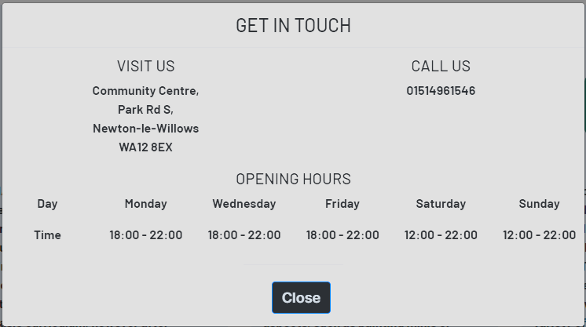

# **N/L/A/W - Newton Local Area Wargamers**

A website created for the first milestone project for Code Institutes full stack developer course. 

[The deployed website can be found here.](https://monkphin.github.io/nlaw/)

# Contents

* [User Experience](#user-experience)
    * [The Clubs Goals](#hobby-lub-oals)
    * [A visitors Goals](#sisitor-goals)

* [Design](#design)
    * [Wireframes](#wireframes)
    * [Colour Palette](#colour-palette)
    * [Typography](#typography)
    * [Images](#images)
    * [Icons](#icons)

* [Features](#features)
    * [Header](#header)
    * [Footer](#footer)
    * [Modal](#modal)
    * [Home Page](#home-page)
    * [Club Page](#club-page)
    * [Contact Page](#contact-page)
    * [Response Page](#response-page)
    * [404 Page](#404-page)
    * [Sticky Nav](#sticky-nav)
    * [Carousel](#carousel)
    * [Future Features](#future-features)

* [Bugs and Issues](#bugs-and-issues)
    * [Home Page](#index.html)

* [Technology](#technology)
    * [Languages](#languages)
    * [Frameworks](#frameworks)

* [Testing](#testing)
    * [HTML Validation](#html-validation)
    * [CSS Validation](#css-validation)
    * [Accessibility](#accessibility)
    * [Performance](#performance)
    * [User Testing](#user-testing)
    * [Performance](#performance)
    * [Responsiveness](#responsiveness)

* [Deployment](#deployment)

* [Credits](#credits)

# User Experience

N/L/A/W is is a local tabletop wargames group that started life as a small afterschool club in a local autism collage. 

The club would like to have a presence online outsied of standard social media to allow other hobbiests and wargame enthusiasts to find out more about the club and what they do, as such they opted to commission someone to develop a website to allow them to do this. 

## Hobby Club Goals: 

* To inform other hobbiests in the Newton-le-Willows area that there is a club space available for like minded hobbiests so that we grow our membership. 
* Provide essential information on the club such as meeting times and location.
* To show images of the club to potential guests and members
* Ideally sign post some of the games that we commonly play
* The website should have a simple and easy to navigate structure that reacts to the type of device its being viewed.
* Visitors should be able to contact the club to be able to enquire about joining us, as well as ask any questions they may have before first visiting. 
* For social channels to be signposted 
* To be designed in a way thats sympathetic to our user bases accessability requirements. 

## Visitor Goals: 

* To find some information about the club such as what games are commonly played. 
* To know when and where the club meet
* To be able to see pictures of the club so that I know what to expect when I visit. 
* To know what the club offers, such as available gaming spaces, places to hobby and to know what facilities are onsite. 
* To be able to contact the club to ask any questions I may have before visitiing 
* To be able to easily navigate the site irrespective of device

# Design 

The design process needed to factor in the clubs history, since many of its members are autistic, thanks to its roots in a local autism college. 

The following sites were used to help research requirements for autism friendly design elements: 

* [Horlix - Making your autism friendly website](https://www.horlix.com/making-your-autism-friendly-website) 
* [Overlay Facts - Digital Accessibility for Autism](https://overlayfacts.org/blog/digital-accessibility-web-design-for-autism)
* [UX Design - Designing for Autistic People](https://uxdesign.cc/designing-for-autistic-people-overview-of-existing-research-d6f6dc20710e)

Due to this, several iterations of the site were wireframed before a look was settled on with attempts to work to the UK Department of Health guidlines for ASM freindly design as outlined [here](https://file.scirp.org/pdf/JSEA_2014022510055814.pdf)

While the final design breaks some of the Department of Health recommendations, steps have been taken to assist where potential for confusion may occur such as the inclusion of bounding boxes. Examples of this method were observed from several other websites that have been lauded for ASM focused design. 

* [Autism Advocacy](https://autisticadvocacy.org) 
* [Sesemae Street](https://sesameworkshop.org/topics/autism) 

Overall I feel this finds a balance between a clean design and an autism friendly one. 

## Wireframes: 

Wireframes were created with Balsamiq software. 

<insert wireframes here>

## Colour Palette. 

The colours were selected to be sympathetic to the user base, using [Paperheart Design's peaceful pallettes](https://paperheartdesign.com/blog/color-palette-peaceful-palettes) to help pick out soothing and low contrast colour palletes that could work for some of the user base. Of those presented, I feel the 'Blueberry Bliss' selection gives a reasonable range of tones and colour options. 

## Typography. 

As with the other design elements, some care was needed around font usage, specifically using sans-serif fonts. 
To this end, after browsing fontpair and google fonts I finally settled on Inter and Barlow, both of which fit guidelines of being clear and sans-serif while looking good. Inter is used for the header and footer, with Barlow being used for the main content. 

Future features that would allow for better levels of support include the ability to pick and choose fonts, font background and  colour options, font size and other similar customisation options. 

## Images

Images were sourced primarily from Games Workshop's website, as well as other hobby club pages, credits for these will be provided at the end of the readme. 

## Icons

Icons were provided by [FontAwesome](https://fontawsome.com)

# Features
The website consists of 4 pages, a **home page**, a **club page**, a **contact page** and a **response page** which loads when the contact form is successfully submitted. The footer of each page also includes a modal, allowing information about the location of the club and its opening times to be available anywhere on the site. Their is also a **custom 404** incase a visitor finds themselves trying to access a noneexistent part of the website, allowing them to head back to the main content. 

## Header
The header allows for simple, responsive navigation so that visitors can utilise its function regardless of the device in use. On larger screens it will expand to take the full space of the browser, while on mobile or narrow screens the menu will collpase down into a hamburger toggle and the additional subheading will vanish to ensure the menu remains uncluttered. 

The menu items show an underline and change to #0b385f to show the current page. They and all other text based links also change colour to #3373b0 on hover to provide feedback . 

## Footer
The footer provides constant access to key information concerning the location and operating hours of the club, this modal responds to changes in screen size with both the opening hours and contact information shifting from horizontal to vertical layout as the amount of visible space decreases. The footer also contains links to various social media platforms where the club has some presence, allowing site visitors to interact with the club other methods as well as see any other pictures of the venue and any hobby activities that may not be present on the website. 

## Modal 
The modal as previously mentioned provides a quick and easy way to find the clubs address and openng hours. The base temaplate for this was taken from an example provided by bootstrap and features some of my own minor amendments to styling and CSS to make it fit the site more closely. Their is also a clickable phone number, which will open your devices default phone system and auto fill the number allowing a user to call the club with minimal effort. 

## Home Page
The sites homepage provides some of the clubs history, as well as information about the wider tabletop gaming hobby and some of the possible benefits it can bring to those partaking of it. This page also features a list of game systems the club members enjoy the most to allow visitors to understand what games they may expect to be able to easily play if they visited in person. Early testing of the site showed some issues with how this was positioned when using mobiles and other smaller screened devices, where the main content was pushed quite far down the page. To resolve this Bootstrap ordering was used to shift the games list to the bottom of the page on smaller screens. However this also proved less than ideal since it just created an overly long vertical scroll. To help mitigate this, the list is hidden on smaller screens and replaced by a carousel.

The page as a whole uses bootstraps grid positioning to allow for positioning and responsive design, with stacked rows to allow for a column containing the list of games to be rendered on the left when on a desktop with the hero image to the right in another column directly above the three columns providing the clubs background, information on tabletop gaming and some information about the club and its members. These will re-order depending on the size of the device, with the hero image showing the main room of the club always remaining at the top of the page. 

Finally, the images in the games list and carousel will grow on mouse over, thanks to Hover.css. 

## The Club page
This page provides more specific information on the club itself, concerning its gaming facilities as well as what food and drink options are available and some basic information regarding costs to access, again the hero image, showing the main room of the club is carried over. This page also features a list of club rules and also the address and phone number for the club, as well as its opening hours and a google map to aid people in visiting. Much like the home page this uses bootstraps grid positioning system with various columnsand rows and some nesting of these to help ensure a clean and responsive layout irrespctive of the device that the site is accessed from. Much like with the modal, the opening times shifts between horizontal and modal depending on the device screen size that the site is accessed from. LIke in the modal, the phone number is clickable and will open the users default calling application with the number pre-populated. 

## Contact
The contact page is a simple form asking for name, email and a message. This has an acton to call response.html, so it doesnt just error out and instead provides feedback to the user that an email has been sent. With further development this would send an email to the clubs email on submission. 

All fields are required in order to submit and the form is configured to be aware of if the email field has not been provided with an email. 

## Response
This page exists purely to provide feedback on submitting the form, rather than just erroring out. 

## 404
A custom 404 error page was added, to keep the user on site in the event of them somehow trying to load a none existing page. This is built using the stock layout to allow uers to easily navigate to any part of the site, rather than just leaving them with no route back or simply sending them back to the home page. 

## Sticky Nav. 
Since the site can get potentially quite long on smaller screen sizes the navbar is configured to remain in view at all times, allowing the user to easily move from page to page if they want to read information on a different page, or perhaps have a question they want to ask of the club while its in mind. 

## Carousel
Due to the index page becoming overly long when showing the list of games the group enjoys, the design was tweaked slightly to shift this list to the bottom of the main content and replace it with a carousel. The carousel was sourced from Bootstrap with some customisation being done to ensure it fit the sites designs, this meant using some fonts from FontAwesome to replace the left and right arrows since the default icons were proving difficult to format correctly.  

## Future features
As mentioned earlier in the document, it would be ideal to allow for a degree of personal customisation at the user level to allow for further improvements to accessability. Adding a calendar that the club can update would also be a useful feature so they could show events that they may have coming up that may be of interest to visitors, this could potentially tie into a mailing list, which would require a database to store user details. Additionally a gallery page could also be of use to show more pictures of the venue or projects the club are working on.
Since I am using an older version of Bootstrap I have already created a development branch with the intention to migrate this over to Bootstrap 5, this will also give me a chance to refactor the HTML and CSS a little, since simply porting over to Bootstrap 5 presented a lot of rendering issues which need to be resolved.  

## Bugs and issues. 
    index.html has some issues with its three content boxes, where they don't auto size to match each others vertical lengths due to having to place them within divs to allow for margins to function without causing the content to overflow to a new row. Their is also an issue with some slight side scrolling on mobile versions of this page, which is likely also related to how the bootstrap layout has been nested. The content boxes are also slightly whider than expected when on mobile, resulting in them filling the horizontal space, rather than having some breathing room around the edges. These issues are being investigsated but may not be resolved by the time the project needs to be handed in. 

    index.html has some minor positioning issues that doesn't directly impact site functionality for the hero text on the hero image. On some smaller screens its not aligned in a way that looks neat or inline with the rest of the site layout. This should be an easy fix with media queries, but I suspect their may be a more elegant way to do this. 

To be fixed. 
index.html - the carousel misrenders on screen widths of 913 to 991 pixels, causing it to overlap over the footer. This can easily be fixed via an additional CSS media query. 

# Technology. 

## Languages
The site was built with HTML and CSS, any javascript in use is provided via Bootstrap, which was needed for the carousel and nav toggle. 

## Framworks/Laungages/Programs. 
* Bootstrap 4.2.1
    * Used for layout and positioning, as well as the navbar, modal and carousel. 

* W3Schools
    * Used for help with CSS. 

* HoverCSS
    * Used to provide 2D transitions on the games images. 

* Git
    * Used for version control, storage and deployment. 

* GoogleFonts
    * Used to import fonts to the stylesheet. 

* VSCode
    * IDE of choice. 

* Balsamiq
    * Wireframing program. 

* WAVE
    * Used to assist with accessability checks. 

* Techsini 
    * Mockup generator.

* Fireshot
    * Chrome PLugin for screenshots. 

* Google Dev Tools
    * Used to help with troubleshooting.

* Pixelmator
    * Users for editing and resizing images.

* TinyPNG
    * used for image compression. 

 * Favicon.io
    * Used to generate a Favicon.

# Testing and Validation
## HTML Validation
[W3C Schools HTML Validator](https://validator.w3.org/)

## CSS Validation
[W3C Schools CSS Validator](https://jigsaw.w3.org/css-validator/)

## Accessability
[WAVE](https://wave.webaim.org) was used to check to ensure the site conforms to accessability standards. Several pages show redundant links - specifically contact.html, response.html and 404.html due to both the site logo and the home link in the nav bar both linking to the hindex page. Additionally club.html shows two redundant links, one due to the aforementioned duplication on the navbar and also due to the telephone number link in the contact modal being a duplicate of the link on the contact section. Other than this, no issues are reported. 

## Performance
Overall loading times and performance were tested using Googles lighthouse tool within Chromes Developer Tools

## Responsiveness

## User Testing. 
Since the site is designed with ASM users in mind, I reached out to several friends who I know are diagnosed with ASM who provided feedback and suggestions. 
Comments included that the colour choice was calming and easy on the eye and that the site was easy to use, read and navigate with minimal issues. 

## User Stories. 

# Deployment. 

# Credits
Images were sourced from a few locations, the deails of which are below. No creator credits were able to be located when checking these websites. 

* Hero Image - [Wargames Reading](https://wargamesreading.co.uk/)

* Main body section images on index.html - [Warhammer](http://warhammer.com)

* Games logos on index.html - 
    * Warhammer 40,000 [Warhammer](http://warhammer.com)
    * Age of Sigmar [Warhammer](http://warhammer.com)
    * Necromunda [Warhammer](http://warhammer.com)
    * Warcry [Warhammer](http://warhammer.com)
    * Kill Team [Warhammer](http://warhammer.com)
    * Horus Heresy [Warhammer](http://warhammer.com)
    * The Walking Dead [Mantic Games](https://www.manticgames.com/)
    * Bolt Action [Warlord Games](http://warlordgames.com)
    * Star Wars Legion [Fantasy Flight Games](https://www.fantasyflightgames.com)
    * Dungeons & Dragons [Wizards of the Coast](https://dnd.wizards.com/)

* Main body images on club.html - [Warhammer](http://warhammer.com)

* 404.html image  [Warhammer](http://warhammer.com)

* Main body image on response.html - [Goonhammer](https://www.goonhammer.com/the-belated-vadinax-week-9-update/)

* Text was adapted from copy found on [Exploding Dice](https://www.explodingdicetabletop.com/)
